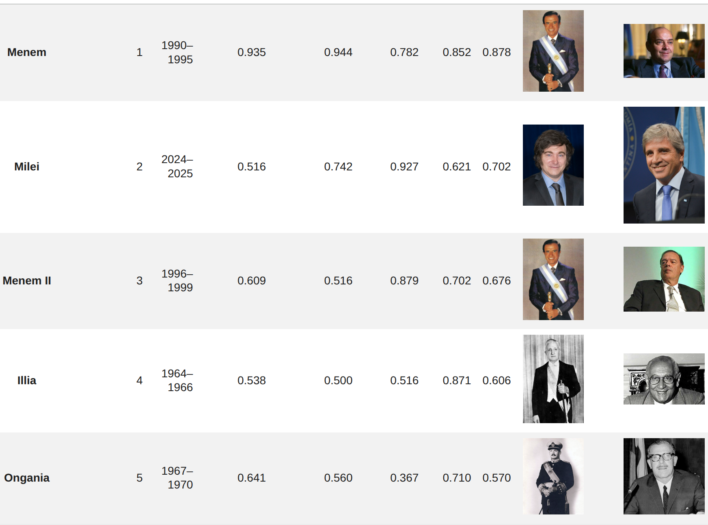

# Still Passing the Buck

A data-driven comparison of how successive Argentine administrations actually
performed economically — ranking them on long-run macroeconomic indicators
(inflation, GDP, public debt, exchange-rate and fiscal pressure) instead of
arguing about it. The analysis combines World Bank World Development Indicators
with official Argentine sources (INDEC, BCRA, Ministerio de Economía, BCRP) and
historical series reaching back to 1853.

📊 **Write-up:** <https://jahnog.github.io/Argentine-monetary-and-fiscal-policies-analyzed/>



## Notebooks

| Notebook | Purpose |
|----------|---------|
| `Historical_CMPI_Extension.ipynb` | Main analysis — extends the Cumulative Monetary Pressure Index with historical and fiscal series. |
| `Still_Passing_the_Buck.ipynb` | Original administration-by-administration comparison. |
| `Transpose_Dataset.ipynb` | Reshapes the wide World Bank export (`WDIData2.csv`) into the long form the notebooks consume. |

## Data

All inputs are kept repo-local (via Git LFS) so the notebooks rerun without live
network access. The folder layout and the full inventory of download/generate
scripts are documented in [`data/README.md`](data/README.md); the methodological
lineage of each Argentine series is in
[`data/argentina/README.md`](data/argentina/README.md).

- `data/raw/<provider>/` — downloaded source files
- `data/processed/<purpose>/` — generated notebook inputs
- `data/provided/` — curated exceptions (`Indicators.csv*`, `data_a_2018.xlsx`, …)

## Reproduce

```bash
uv sync                                    # create the environment from pyproject.toml / uv.lock

# refresh data (network required) — one download script per external source,
# then the generators that build the notebook inputs:
python scripts/download_*.py
python scripts/generate_*.py
python scripts/validate_cmpi_inputs.py --target-year 2025

jupyter notebook Historical_CMPI_Extension.ipynb
```

Export the notebook to a print-optimized PDF with
`scripts/render_notebook_paper.py` (see [`docs/paper-export.md`](docs/paper-export.md)).

## Tests

```bash
pytest -m "not network"      # offline unit tests
pytest -m network            # tests that hit live data sources
```

## Stack

Python · pandas · NumPy · matplotlib · Jupyter · uv · Git LFS
