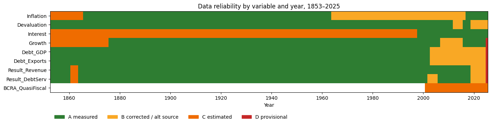
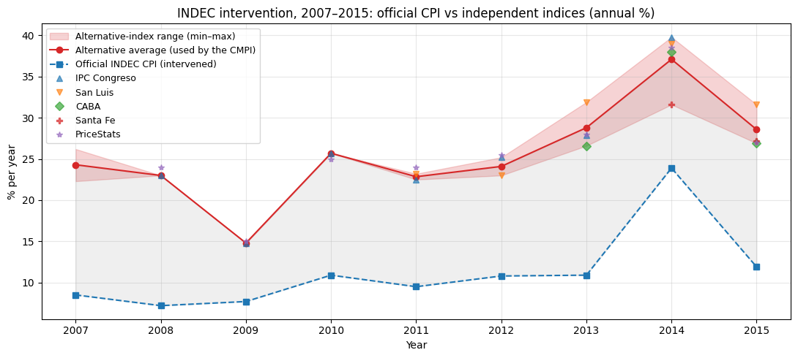
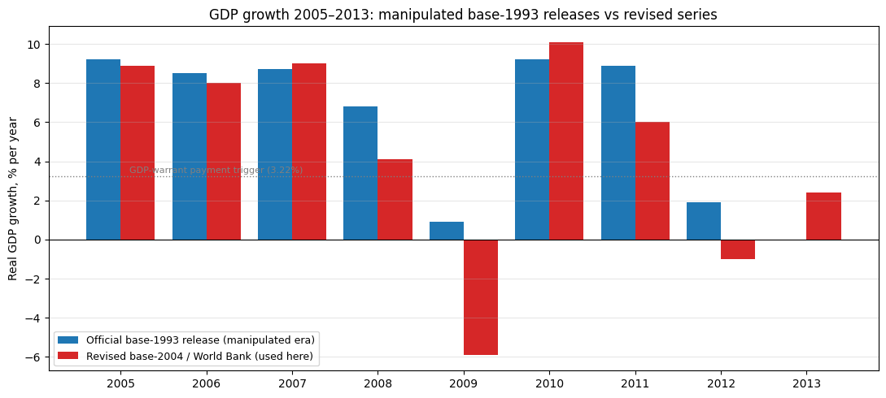
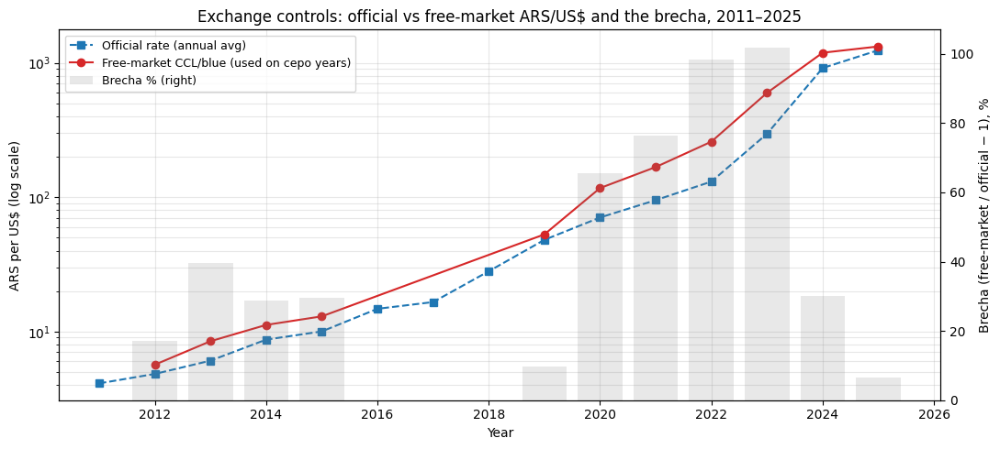
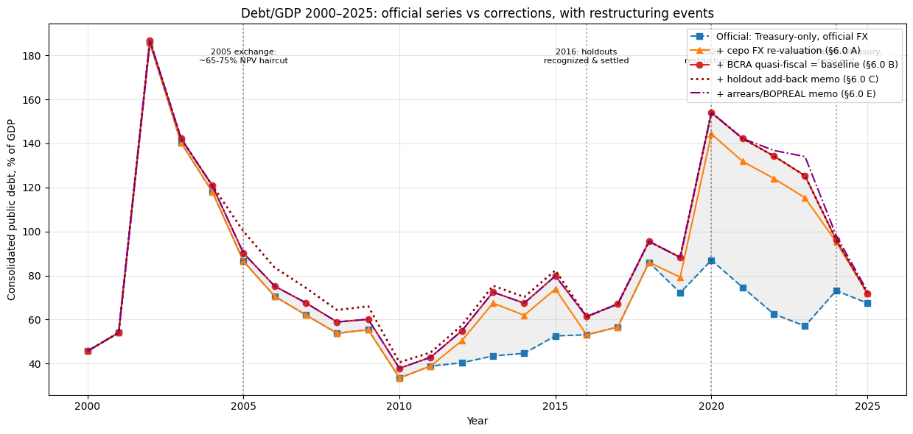
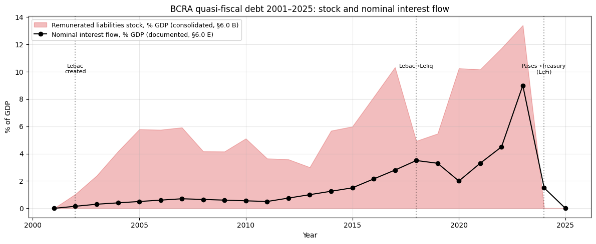
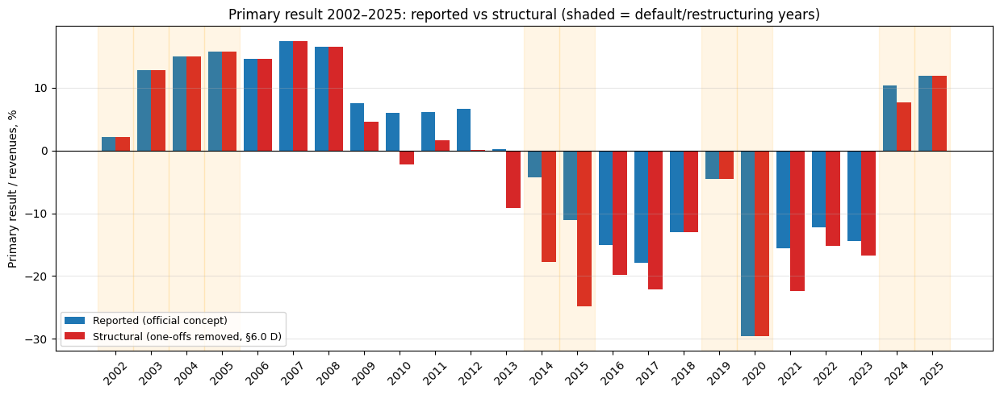

<!--
  HOW THIS FILE WORKS
  - This is pandoc Markdown. Edit prose freely; build with `make paper`.
  - Lines of the form "{{table" + ":NAME}}" are replaced at build time with tables
    extracted from the executed notebook (see scripts/build_paper.py), so the
    paper's numbers always match the pipeline. The caption line (": ...")
    must stay immediately below the directive.
  - Figures are PNGs extracted from the notebook into paper/generated/.
  - Citations use [@key] / @key with paper/references.bib (Chicago author-date).
  - Table/figure numbers in the prose are written manually ("Table 3"): if you
    reorder floats, update the references. TODO markers flag editorial work.
  - NOTE: the notebook cites the source chapter as 2011 (Cambridge online
    edition); this manuscript uses the 2003 print edition year. Keep one.
-->

# Introduction

How well did each Argentine government manage the economy it inherited? The
question dominates Argentine public debate, yet it is usually argued with
absolute outcomes --- inflation under one president against inflation under
another --- which conflates what a government did with what it received.
@dellapaolera2003passing proposed a comparative answer: score each
administration by the *improvement* it delivered over the macroeconomic and
fiscal situation bequeathed by its predecessor, and rank all administrations on
a common percentile scale. Their Classical Macroeconomic Performance Index
(CMPI) aggregates inflation, devaluation, the hard-currency interest rate, and
per-capita growth; their Fiscal Pressure Index (FPI) adds the management of the
intertemporal budget constraint; the average of the two is an Overall Index.
Applied to 33 administrations over 1853--1999, the framework produced the
central finding the authors summarized in their title: Argentine governments
repeatedly bought contemporaneous macroeconomic calm with fiscal pressure that
they passed to their successors.

This paper extends the complete two-index framework to the full 1853--2025
span --- 41 administrations and a percentile pool of 173 annual observations ---
placing the original 33 historical terms and the eight administrations of
2000--2025 on a single, internally consistent scale. The extension is not a
mechanical appending of recent data. Between 2007 and 2015 the national
statistical institute (INDEC) understated consumer-price inflation by a factor
of roughly three to four and overstated real growth, episodes that led to the
first declaration of censure in the history of the International Monetary Fund
[@imf2013censure; @cavallo2013; @coremberg2017]. Exchange controls in 2012--15
and 2019--25 pinned the official exchange rate far below the free-market rate.
Successive governments accumulated remunerated central-bank liabilities --- a
quasi-fiscal debt reaching roughly ten percent of GDP --- that appears in no
Treasury debt statistic. Any ranking that ingests official series uncritically
reproduces these distortions. A second, subtler problem is internal to the
methodology: annual-average exchange rates produce wrong-signed devaluation
innovations around mid-year devaluations, an artefact that affects the
historical sample as well as the modern one.

Our contributions are four. First, we construct corrected 1853--2025 series for
the nine variables behind the two indices, documenting every known statistical
manipulation and accounting practice that materially affects them --- a
twenty-one-entry catalogue (Section 4, Appendix B) stating the direction of
each bias and its treatment. Corrections enter the baseline only when an
independent, reproducible source exists (alternative price indices, free-market
exchange quotations, revised national accounts, central-bank balance sheets);
judgment-dependent adjustments enter only as sensitivity variants, reported
whichever administration they favour. Second, we resolve the annual-average
devaluation artefact by using December-quotation exchange-rate series for the
entire sample. Third, we extend the FPI with two corrections to the modern
debt-stock components: a free-market revaluation of GDP during
exchange-control years, and the consolidation of the central bank's
remunerated liabilities into the public debt stock. Fourth, we validate the
implementation by replicating the original published rankings on the
restricted 1853--1999 pool, obtaining Spearman rank correlations of $0.997$
(FPI) and $0.952$ (CMPI) against the original Table 3.4.

The headline results place Menem (1990--95) first on the CMPI and the Overall
Index, with the 2024--25 stabilization and Obligado's 1854--56 reforms close
behind, and crisis terms at the bottom --- consistent with the original
finding that durable hard-currency and convertible stabilizations score
highest. The fiscal corrections are decisive for the modern ranking: once the
central bank's hidden debt is consolidated and the exchange-control distortion
removed, the administrations that *built up* quasi-fiscal liabilities fall to
the bottom of the FPI, while the 2024--25 consolidation registers as a sharp
reduction in fiscal pressure rather than the spurious increase shown by the
raw Treasury series. The long-run picture confirms the *passing-the-buck*
dynamic over 173 years.

The paper proceeds as follows. Section 2 situates the contribution in the
literature. Section 3 presents the methodology. Section 4 describes the data
and the corrections. Section 5 reports the rankings. Section 6 validates the
implementation against the original study. Section 7 reports robustness
exercises. Sections 8--10 discuss interpretation, limitations, and
conclusions. A complete replication package accompanies the paper
(Appendix A).

# Related literature

The paper extends @dellapaolera2003passing, chapter 3 of *A New Economic
History of Argentina* [@dellapaolera2003newhistory], which built the CMPI and
FPI for 1853--1999. The long-run quantitative history of Argentine money and
finance on which that chapter rests includes @dellapaolera2001straining on the
currency-board era, @dellapaolera1994experimentos and @cortesconde1989dinero
on nineteenth-century monetary and fiscal experiments, @irigoin2000 and
@amaral1988 on the early inflationary-finance period, and the long statistical
series compiled by @ferreres2010dossiglos. General economic histories of the
period include @gerchunoffllach1998 and @rapoport2000.

The measurement problems of modern Argentine statistics have their own
literature. @cavallo2013 documents the 2007--2015 INDEC consumer-price
intervention using online prices; @cavallorigobon2016 generalize the
methodology; @coremberg2017 quantifies the parallel overstatement of real
output growth; the IMF's declaration of censure [@imf2013censure] is the
institutional landmark. Our contribution to this strand is practical: a
documented, reproducible mapping from each known distortion to its effect on a
long-run performance ranking --- including the quasi-fiscal liabilities and
exchange-control wedges that standard debt and exchange-rate series omit.

The theoretical background of the indices --- seigniorage and the inflation
tax, the intertemporal budget constraint, and currency-crisis contagion --- is
the classical one [@sargent1986rational; @defiore2000; @ennis2007;
@eichengreen1996contagious].

<!-- TODO: consider adding recent rankings/state-capacity literature, and any
     post-2003 work that has extended or criticized the CMPI/FPI. -->

# Methodology

## The Classical Macroeconomic Performance Index

The CMPI aggregates four classical variables: **inflation**, linked to the
government's high-powered-money policy and seigniorage; **devaluation**, the
willingness to defend the external value of the currency; the **real interest
rate on hard currency**, a proxy for country risk and external credit
tightness; and **per-capita growth**, the administration's influence on the
pace of real activity.

For each variable and year we compute the **innovation**: the value in that
year minus the value in the *last year of the previous administration* --- the
inherited, or "legacy," condition. Each annual innovation is converted to a
percentile rank across all $O$ years in the pool using the original Appendix A
formula $R = (O - o)/O$, where $o$ is the innovation's position in the ranking
(best $=1$): the best innovation in the pool scores $(O-1)/O \approx 0.994$
and the worst scores $0$. An administration's CMPI is the average of its four
percentile scores over its term; higher is better. Inflation and devaluation
enter as continuously compounded rates $\ln(1+x)$, which prevents extreme
episodes from dominating the index.

To be concrete: a year in which inflation fell from an inherited 40 percent to
10 percent produces an innovation of roughly $-0.36$ log-points. This scores
near the top of the percentile distribution and contributes to a high CMPI
*regardless of whether 10 percent is "low" in absolute terms*. The comparative
design is what makes the index informative about governance rather than about
inherited luck.

## The Fiscal Pressure Index

The CMPI captures contemporaneous performance, but for a peripheral economy
with recurrent debt crises this is insufficient. The FPI ranks administrations
by their management of the intertemporal budget constraint, built on the
first-order difference equation for the debt ratio that drives the original
study's transversality condition:

$$\frac{B_t}{Y_t} = \frac{1+r_t}{1+g_t}\,\frac{B_{t-1}}{Y_{t-1}} + \frac{DEF_t}{Y_t},$$

where $B/Y$ is the debt-to-GDP ratio, $r$ the real interest rate, $g$ the
growth rate, and $DEF$ the primary deficit. The FPI aggregates five
indicators, each scored exactly like the CMPI as an innovation percentile:
**debt/GDP** (the burden relative to activity), **debt/exports** (the burden
relative to repayment capacity), **primary result/revenues** (net fiscal
management, discounting inherited debt service), **primary result/debt
service** (resources available to service the debt), and **$(1+r)/(1+g)$**
(the amplifying factor on the debt ratio; values above one mean the debt
ratio grows automatically even with a balanced primary budget). High
indebtedness or an unbalanced budget is a "hot potato" passed to successors;
the opposite is a positive externality future governments inherit.

Following the original Table 3.4, the **Overall Index** ranks administrations
by the simple average of their CMPI and FPI scores.

## How to read the ranking: three structural caveats

The method has three properties that every reader should hold in mind. They
are features of the original design, applied uniformly to all 41
administrations --- not data corrections, and not fixable without changing
what the index measures.

1. **Improvement is not the end state.** The index scores each year against
   the situation *inherited*, averaged over the term --- not the state in
   which an administration leaves the country. A term that inherits a
   catastrophe and stabilizes it scores high even if absolute conditions
   remain poor; a term that inherits calm and ends in crisis scores low even
   if its average year was comfortable. Section 8 discusses the clearest
   modern case.

2. **Term averages favour short corrective shocks.** Stabilizations
   front-load their best macroeconomic years, so a two-year term can outscore
   four-to-six-year terms that include later decay. Section 7 re-scores every
   administration on its first two years only, putting partial terms on an
   equal footing.

3. **Single-year inherited baselines amplify V-shaped shocks.** Because every
   year of a term is measured against the predecessor's *last* year, a
   collapse-and-rebound pair inside one term (COVID: $-10.3$ percent
   per-capita growth in 2020, $+10.2$ percent in 2021) is lightly penalized on
   the way down and fully rewarded on the way back. Section 7 includes a
   variant that drops 2020--21 from the percentile pool.

## Administration boundaries

The 41 terms follow the original intervals exactly where the two studies
overlap (33 terms, 1853--1999), including the rule of assigning each year to
whoever ruled the larger part of it. Conventions carried over from the
original study: single-year caretaker terms are kept separate when
conventionally distinguished (Alsina 1853, Uriburu 1931, Guido 1962--63);
military juntas are presented as one term (1976--83); civilian transition
periods with rapid turnover are combined. For 2000--2025, beyond the original
span, 2001--03 is split as De la Rúa (to 2001) and Duhalde (2002--03) to
separate the crisis trough from the stabilization --- the single deliberate
exception to the majority-of-year rule, which keeps the post-default
stabilization program in one piece. The 2024--25 term is partial by
construction and is decomposed year by year in Section 6. A sensitivity
experiment merging the shortest one-year terms into their neighbours moved
only bottom CMPI ranks and left the top ten and all FPI and Overall top-five
positions unchanged.

# Data

## Two data regimes

The series combine two regimes. For **1852--1963** we use the original
authors' annual dataset (`data_a_2018.xlsx`) directly: inflation and
devaluation as annual log-differences, per-capita growth, and the four fiscal
ratios. Interest rates use the published term averages of the original Table
3.1, since the dataset contains no annual interest series; the 1852 baseline
is derived from the original Table 3.2. For **1964--2025** we use annual
values from the World Bank World Development Indicators [@worldbank_wdi],
INDEC price and national-accounts series, the EMBIG Argentina country-risk
spread from 1998 [@bcrp_embig], total Sector Público Nacional gross debt from
the Secretaría de Finanzas [@secfinanzas_deuda], and budget execution from
the national open-data portal [@datosgobar_presupuesto]. Free-market
exchange-rate quotations for the exchange-control years come from public
APIs [@argentinadatos_fx] and the December-quotation devaluation series for
1960--1999 from @ruiz1990dolar and the original dataset.

Figure 1 maps data reliability by year and variable; the full lineage of
every series is documented in the replication package.

{width=100%}

## Statistical integrity: known manipulations and their treatment

An honest comparison of Argentine administrations must confront a hard fact:
several governments distorted the statistics themselves, or used fiscal and
monetary accounting that flatters the headline numbers while shifting costs
off the books. Appendix B catalogues every such practice known to materially
affect the nine variables behind the CMPI and FPI --- twenty-one entries
spanning 1931--2025 --- stating for each the direction of the bias and its
treatment here.

The treatment discipline is uniform. **Corrected** practices are fixed in the
baseline series, with the official series kept as an audit column and an
official-versus-corrected comparison chart beside each correction, so the size
of the distortion is visible rather than asserted. **Sensitivity** practices
involve judgment-dependent estimates, so they enter as documented memo columns
and re-ranked variants --- never silent baseline changes --- reported
whichever administration they favour. **Documented** practices are outside the
nine index variables or not confidently quantifiable, and are flagged for the
reader. No adjustment relies on the say-so of any government, including the
current one.

Four corrections carry the baseline:

**Consumer prices, 2007--2015.** The INDEC intervention understated inflation
roughly three- to four-fold; the episode ended in the IMF censure
[@imf2013censure] and a criminal conviction of the responsible Commerce
Secretary. The baseline replaces 2007--2015 official inflation with the
average of alternative indices (IPC Congreso, San Luis, CABA, Santa Fe),
consistent with the online-price evidence of @cavallo2013. Figure 2 shows the
official series against the alternatives.

{width=100%}

**Real output growth, 2007--2015.** The base-1993 national accounts overstated
volume growth (2008 official $+6.8$ versus revised $+3.1$ percent; 2009
$+0.9$ versus $-5.9$). The World Bank series used here embed INDEC's 2016
revision, whose cumulative 2008--15 correction matches the independent
ARKLEMS reconstruction [@coremberg2017]. Figure 3 compares the vintages.

{width=100%}

**Devaluation: December quotations for the full sample.** Annual-average
exchange rates blend pre- and post-devaluation months, producing wrong-signed
innovations around mid-year devaluations. We use December quotations for the
entire 1853--2025 span: the original authors' series to 1999 (which embeds
the free-market *dólar libre* of @ruiz1990dolar for 1960--89), then December
BCRA wholesale rates in free years and December free-market (CCL/blue)
averages in exchange-control years from 2000. Section 6 shows that this
choice reproduces the original published devaluation innovations exactly for
the four terms affected by mid-year devaluations.

**Exchange-control wedges.** During the *cepo* years (2012--15, 2019--25) the
official rate was administratively pinned with a free-market premium that
reached 100 percent. Devaluation uses free-market December averages (Figure
4); the fiscal corrections below remove the parallel distortion of the
dollar-valued GDP in the debt ratios.

{width=100%}

## Two corrections to the modern debt stock

The FPI's two debt-stock components require corrections that no official
series provides.

First, the **exchange-control revaluation**: during cepo years the
dollar-valued GDP in the debt/GDP denominator is inflated by the artificially
low official rate. The correction revalues output at the free-market rate,
bounded from below by a conservative variant that assumes only half the debt
stock is foreign-currency-linked, and complemented by a variant using the
measured currency composition of the debt (Section 7).

Second, the **consolidation of quasi-fiscal debt**: from 2002 the central
bank sterilized monetary emission with remunerated liabilities (Lebac/Nobac,
then Leliq, then Pases) that peaked near ten percent of GDP --- economically
public debt, but absent from every Treasury statistic. The correction adds
the documented year-end stock to the public debt of 2003--2025. Figure 5
shows the layered debt stock; Figure 6 shows the associated quasi-fiscal
interest flow, which never enters the Treasury's primary result.

Table 1 summarizes both corrections by administration. The corrections are
decisive for the modern fiscal ranking (Section 5), and symmetric: they
penalize the administrations that accumulated hidden liabilities and credit
those that consolidated them, whichever side of the political spectrum either
falls on.

{{table:cepo-bcra}}
: Exchange-control factor and central-bank quasi-fiscal debt by administration (term means). "Cepo x" is the free-market/official revaluation factor applied to dollar GDP; "BCRA % GDP" is the remunerated-liability stock consolidated into public debt.

{width=100%}

{width=100%}

The same discipline governs the primary-balance components: one-off revenues
booked above the line (pension-fund nationalization flows, SDR allocations,
tax amnesties, export-duty advances) and accounting practices that flatter
the cash result (unpaid interest during default, capitalizing instruments in
2024--25) are documented per-row with sources, and enter re-ranked
sensitivity variants (Section 7). Figure 7 contrasts the official and
structural primary results.

{width=100%}

# Results

## Contemporaneous macroeconomic performance

The CMPI ranking of all 41 administrations is reported in Table 2. Menem
(1990--95) ranks first, the 2024--25 stabilization second, and Obligado
(1854--56) third; the bottom of the table collects the crisis terms ---
Alsina (1853), Guido (1962--63), and the hyperinflation endgame of Alfonsín
(1984--89).

<!-- TODO: verify the bottom-three names against Table 2 after the next
     pipeline refresh; the prose must always match the generated table. -->

{{table:cmpi}}
: The Classical Macroeconomic Performance Index, all 41 administrations, 1853--2025. Component columns are mean innovation percentiles over the term; the pool is 173 annual observations.

## Fiscal pressure

Table 3 reports the FPI. Obligado (1854--56) leads, with the 2024--25 term
second and Roca II (1899--1904) third. The two debt-stock corrections of
Section 4.3 drive the modern reordering: the 2023 inherited baseline carries
both the peso overvaluation (a factor near two) and roughly ten percent of
GDP in central-bank debt, against which the 2024--25 consolidation and
record primary surplus register as a sharp *reduction* in fiscal pressure ---
rather than the spurious debt increase shown by the raw Treasury series ---
while the administrations that grew the quasi-fiscal stock (2020--23 and
2012--15) fall to the bottom of the table. Néstor Kirchner (2004--07)
remains high on the FPI because the 2005 restructuring cut the far larger
Treasury debt even as sterilization began: the consolidation captures the
build-up without letting it overwhelm a genuine deleveraging.

{{table:fpi}}
: The Fiscal Pressure Index, all 41 administrations. Components are innovation percentiles of debt/GDP, debt/exports, primary result/revenues, primary result/debt service, and $(1+r)/(1+g)$.

## The Overall Index

Table 4 combines the two indices. Menem (1990--95) remains first, Obligado
second, and the 2024--25 term third. The joint reading exposes the central
*passing-the-buck* dynamic: administrations with a high CMPI rank paired with
a low FPI rank bought macroeconomic calm with debt --- on the Treasury's
books or hidden in the central bank --- and handed the bill to their
successors. The 2024--25 term is unusual in the modern era for ranking in
the top tier on both dimensions, with the caveats of Sections 6 and 8: the
term is partial, and two measurement conventions that favour it are flagged
symmetrically with the Kirchner-era corrections.

{{table:overall}}
: The Overall Index: average of CMPI and FPI scores, with component ranks and a Borda-count cross-check.

# Validation against the original study

The implementation is validated against three benchmarks.

**Replication of the published rankings.** Restricting the percentile pool to
1853--1999 removes the pool-expansion effect, so any deviation from the
original Table 3.4 reflects only the two known data differences (flat
within-term interest averages, and WDI-sourced inflation and growth for
1964--99). On this restricted pool the FPI reproduces the original fiscal
ranking with Spearman $\rho = 0.997$ and the CMPI with $\rho = 0.952$. The
devaluation convention is validated term by term: the December-quotation
series reproduces the original published Table 3.2 devaluation innovations to
the decimal for the four administrations that followed mid-year devaluations
(Illia, Onganía, Perón III, and the 1976--83 junta), where annual-average
data produce the wrong sign.

**Cross-notebook consistency.** The 1964--1999 overlap with the companion
modern-period implementation is rank-identical on shared terms.

<!-- TODO: state the exact overlap statistic from notebook §8.3 here. -->

**Decomposition of the partial 2024--25 term.** Table 5 decomposes the
2024--25 years against the first two Menem years. The structure is the
corrective-shock one: a first year dominated by the devaluation and interest
components against a hyper-distressed inherited baseline, and a second year
in which the disinflation component takes over. The comparison bounds the
interpretation of a partial term: on a first-two-years basis (Section 7) the
2024--25 program and the Menem stabilization are statistically adjacent.

{{table:milei-menem}}
: Year-by-year CMPI decomposition: the partial 2024--25 term versus the first two years of the Menem stabilization.

# Robustness

**Rank stability under resampling.** Across 300 bootstrap resamples of the
pool years, the CMPI medians hold Menem first (10--90 percent band 1--1),
the 2024--25 term in band 2--9 (top five in 70 percent of resamples), and
Obligado in band 2--4.

**Sensitivity variants.** Every judgment-dependent adjustment is re-ranked
and reported whichever administration it favours: the cepo revaluation under
measured currency composition and under the conservative 50 percent
lower bound (Table 6); accrued interest during the 2002--05 default and the
holdout add-back; the 2024--25 capitalizing-interest rescaling; the
structural primary balance with one-offs removed; the paired importer-arrears
and BOPREAL add-back; contingent liabilities (the YPF judgment and Paris Club
arrears); the 1977--90 quasi-fiscal stock, which bounds the asymmetry that
otherwise flatters the 1980s terms relative to 2003--25; a 1946--59
parallel-premium overlay for the historical exchange controls; alternative
inflation indices including a CABA-index variant for 2024--25; and a no-COVID
pool variant. None of the variants displaces the top of the Overall ranking;
the largest movements are within the modern FPI block, documented case by
case in the replication package.

{{table:fpi-sensitivity}}
: FPI rank sensitivity for the focus administrations under the exchange-control and growth-definition variants.

**Term length.** Re-scoring every administration on its first two years only
(Table 7) puts partial and complete terms on an equal footing and confirms
that the term-average design, not data choices, drives the strong showing of
short corrective terms.

{{table:first-two-years}}
: Full-term versus first-two-years CMPI ranks, selected administrations.

# Discussion

The 173-year unified ranking reproduces the main findings of the original
study for the historical period while placing the 2000--2025 administrations
on the same scale. Stabilizations anchored to hard-currency or convertible
regimes score highest --- Menem's Convertibility first in both the original
and here; Obligado's 1854--56 reforms, which ended decades of inflationary
finance, near the top --- and crisis terms score lowest. The 2024--25
disinflation scores highly even in this long-run context.

Three interpretive points deserve emphasis.

**What the index measures.** The CMPI rewards improvement relative to the
inherited year, averaged over the term --- not the state in which an
administration leaves the country. The clearest modern case is the
Fernández (2020--23) versus Macri (2016--19) inversion: Macri had lower
absolute inflation, devaluation, and country risk, yet ranks just below
Fernández, because Macri inherited the calm, exchange-control-pinned 2015
economy and bequeathed the 2019 crisis against which Fernández is then scored
each year. COVID amplifies the inversion through the V-shaped 2020--21 pair.
This is an artefact of the single-year inherited baseline --- a design
feature, disclosed and bounded in Section 7 --- and the ranking should be
read alongside the contemporaneous record (Appendix C).

**Why the data corrections are decisive.** Four adjustments determine the
credibility of the modern ranking: the alternative price indices stop the
2007--2015 intervention from inflating the affected scores; the country-risk
spread removes a fabricated interest improvement in 2020--23 and exposes the
2024--25 collapse in country risk; the December-quotation devaluation series
fixes the wrong-signed innovations around mid-year devaluations; and the
two debt-stock corrections keep the fiscal components from mismeasuring the
2003--2025 terms in both directions.

**The passing-the-buck reading.** Administrations that pair a high CMPI with
a low FPI purchased calm with future resources. The quasi-fiscal channel is
the modern refinement of the original thesis: where the nineteenth-century
version of the dynamic ran through Treasury debt and suspension of
convertibility, the twenty-first-century version runs through the central
bank's balance sheet --- invisible in the official debt statistics that the
original authors could take at face value for their period.

# Limitations

The principal limitations, each documented in the replication package and
bounded by a sensitivity variant where feasible:

- **Historical interest rates (1852--1997) use published term averages**, so
  historical administrations have flat within-term interest variation; with
  WDI-sourced 1964--99 inflation and growth, this is the main remaining
  source of divergence from the original ranking ($\rho = 0.952$).
- **Data-regime seam at 1963/64** for inflation and growth; devaluation has
  no seam; interest switches from term averages to the EMBIG spread in 1998.
  The modern interest dimension is a *spread*, not a rate level, so
  innovations crossing the 1997/98 seam embed a small level shift.
- **The FPI's $(1+r)/(1+g)$ uses per-capita growth** (the only annual series
  available across the full span) where the original defines $g$ as total
  growth; innovations difference out slow-moving population growth almost
  entirely, and the total-growth variant moves every focus rank by at most
  one position (Table 6).
- **The exchange-control revaluation assumes a foreign-currency-linked debt
  stock**; the measured-composition and 50-percent variants bound the
  correction from both sides.
- **The quasi-fiscal series is anchored, not continuous**: year-end stocks
  are documented anchors with interpolation between them, and the
  consolidation starts in 2003; the 1977--90 stock enters only as a
  sensitivity variant.
- **A debt-definition seam at 2018/19**: the historical ratios use the
  original central-government concept, the 2019--25 extension uses total
  Sector Público Nacional gross debt.
- **Pool non-comparability**: adding eight modern terms changes every
  historical percentile; the full-pool ranking is an extension, not a
  reproduction, of the original 33-term table.
- **Two 2024--25 measurement caveats work in the current administration's
  favour** and are flagged symmetrically with the Kirchner-era corrections:
  cash-basis results exclude capitalizing interest, and the 2004--05-basket
  CPI understates the services-led relative-price normalization. Both are
  bounded by variants (Section 7).

# Conclusion

Applying both indices of @dellapaolera2003passing across the full 1853--2025
span places all 41 Argentine national administrations on a single, internally
consistent scale. The method's logic --- judging each government by the
macroeconomic and fiscal improvement it delivers over the situation it
inherited --- puts durable hard-currency and convertible stabilizations at
the top and crises, and the terms that bequeath them, at the bottom. The
unified ranking reproduces the original historical results almost exactly on
the restricted pool while extending them through 2025 with corrected data:
alternative price indices for the 2007--2015 statistical intervention, a
country-risk spread for the modern interest series, free-market exchange
rates for the control years, December-quotation devaluations throughout, and
--- for the fiscal dimension --- an exchange-control revaluation and the
consolidation of the central bank's quasi-fiscal debt.

The Overall Index confirms the original *passing-the-buck* thesis over the
long run: administrations that purchased macroeconomic calm with debt --- on
the Treasury or hidden in the central bank --- handed the bill to their
successors. Making the hidden half of that debt visible is, we would argue,
the precondition for any honest scoreboard of Argentine economic governance.

# Reproducibility {#sec:repro .unnumbered}

**Appendix A.** The complete replication package --- the analysis notebook,
all input data with documented lineage, download and generation scripts, an
input validator, unit tests, and continuous integration that re-executes the
full pipeline --- is available at
<https://github.com/jahnog/still-passing-the-buck>.
Every table and figure in this paper is extracted programmatically from the
executed notebook by the build script (`scripts/build_paper.py`), so prose
and pipeline cannot silently diverge. Data vintages are stamped in the
package; baseline-affecting revisions are logged.
<!-- TODO: after the Zenodo deposit, cite the archived release DOI here. -->

# The statistical-integrity catalogue {#sec:catalogue .unnumbered}

**Appendix B.** The full twenty-one-entry catalogue, with per-row sources, is
maintained in the replication package; the condensed version follows.
"Corrected" practices are fixed in the baseline (official series kept as
audit columns); "Sensitivity" practices enter re-ranked variants only;
"Documented" practices are flagged for the reader.

| # | Practice | Period | Bias | Treatment |
|:--|:---------------------------------------------|:------------|:-----------------------|:------------|
| 1 | INDEC CPI intervention (under-stated 3--4x) | 2007--15 | Inflation down | Corrected |
| 2 | GDP volume overstatement, base-1993 accounts | 2007--15 | Growth up | Corrected |
| 3 | GDP-warrant payouts on overstated growth | 2009--14 | Fiscal flows (both) | Documented |
| 4 | Exchange controls (cepo), official rate pinned | 2012--15, 2019--25 | Devaluation, debt/GDP down | Corrected |
| 5 | Historical exchange controls and parallel premia | 1931--59 | Devaluation down | Sensitivity |
| 6 | "Surplus" while in default (unpaid interest) | 2002--05 | Result/debt-service up | Sensitivity |
| 7 | Holdout debt excluded from official stock | 2005--15 | Debt down | Sensitivity |
| 8 | CER under-indexation of inflation-linked debt | 2007--15 | Debt, interest down | Documented |
| 9 | Pension nationalization booked as revenue | 2008--15 | Result/revenue up | Sensitivity |
| 10 | Reserve hollowing; paper profits as revenue | 2006--15, 2021--23 | Result/revenue up | Sensitivity |
| 11 | Hidden central-bank debt stock (Lebac/Leliq/Pases) | 2002--24 | Debt down | Corrected |
| 12 | Hidden central-bank deficit (quasi-fiscal flow) | 2004--24 | Result up | Sensitivity |
| 13 | 1980s Cuenta de Regulación Monetaria | 1984--89 | Debt down, result up | Sensitivity |
| 14 | One-off revenues above the line (SDR, amnesties) | various | Result/revenue up | Sensitivity |
| 15 | Importer arrears / BOPREAL conversion | 2022--25 | Debt down, then up | Sensitivity |
| 16 | Cash surplus excluding capitalizing interest | 2024--25 | Result up | Sensitivity |
| 17 | CPI basket vintage (2004--05 weights) | 2017--25 | Inflation down | Sensitivity |
| 18 | Price controls; repressed inflation to successor | several | Incumbent inflation down | Documented |
| 19 | Statistics blackouts; labour-data masking | 2002--16 | Non-index inputs | Documented |
| 20 | Crisis balance-sheet transfers (1982, 1989, 2002) | as listed | Debt up (real) | Documented |
| 21 | Contingent liabilities (YPF judgment, Paris Club) | 2002--25 | Debt down | Sensitivity |

: The statistical-integrity catalogue (condensed). Full entries with affected terms, magnitudes, and per-row sources are in the replication package.

# The contemporaneous record {#sec:contemporaneous .unnumbered}

**Appendix C.** For the reader who wants the absolute outcomes alongside the
innovation-based ranking, the table below reports term-average inflation,
devaluation, interest, and growth for all 41 administrations.

{{table:contemporaneous}}
: Contemporaneous (absolute) term averages, all 41 administrations. This is the record against which the caveat of Section 3.3 should be read.

# References {.unnumbered}

::: {#refs}
:::
