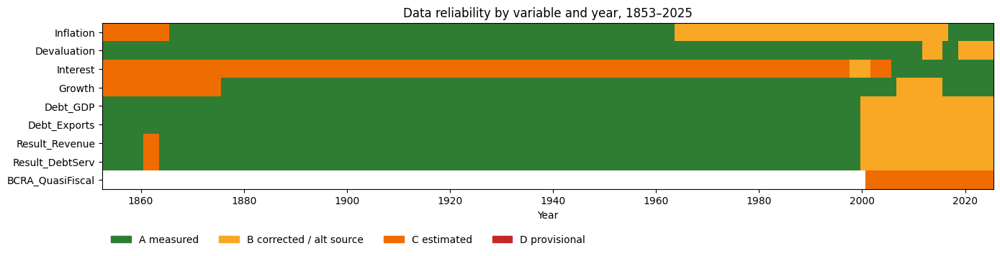
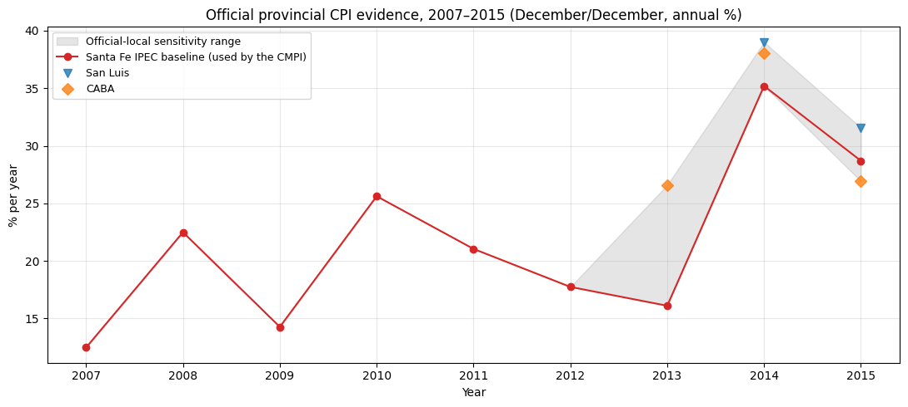
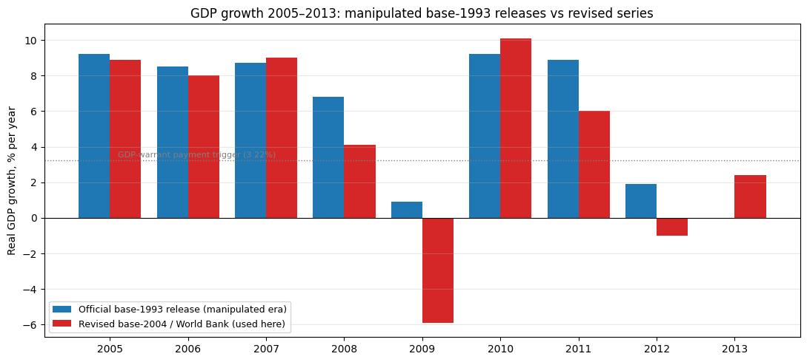
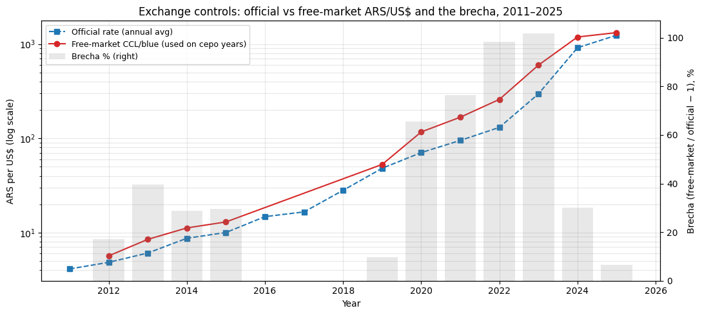
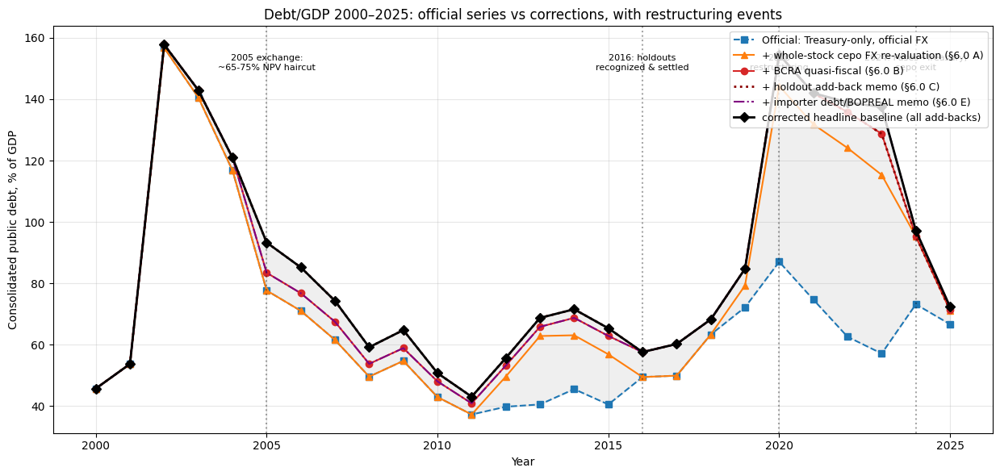
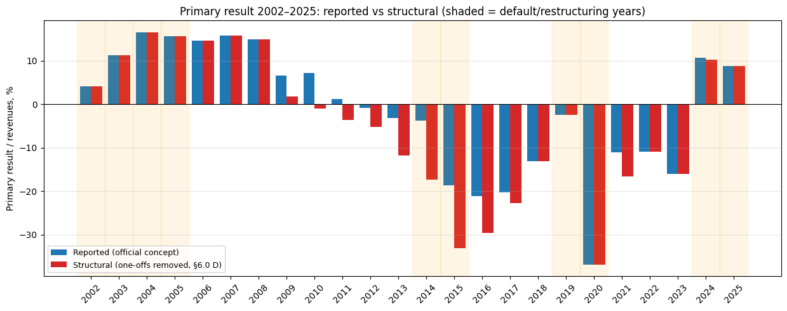

<!--
  HOW THIS FILE WORKS
  - This is pandoc Markdown. Edit prose freely; build with `make paper`.
  - Lines of the form "{{table" + ":NAME}}" are replaced at build time with tables
    extracted from the executed notebook (see scripts/build_paper.py), so the
    paper's numbers always match the pipeline. The caption line (": ...")
    must stay immediately below the directive.
  - Figures are PNGs extracted from the notebook into paper/generated/.
  - Citations use [@key] / @key with paper/references.bib (Chicago author-date).
  - Table/figure numbers in the prose are written manually ("Table 3"): if you
    reorder floats, update the references.
-->

# Introduction

> **How to read the indices.** The CMPI and FPI measure *improvement*
> relative to the situation inherited from the previous administration ---
> not absolute levels. An *innovation* is that year-minus-inherited change.
> Component scores are percentiles of annual innovations pooled over the
> 173-year frame: a score of 0.90 means the administration's average annual
> improvement sat in the top 10 percent of all improvements recorded since
> 1853. The FPI asks a further question: did the administration reduce or
> raise the debt and deficit burden facing its successor? Rank 1 is best on
> this improvement metric. See Section 3 for the formulas and three
> structural caveats, Section 7 for robustness, and the Glossary
> (Appendix E) for terminology.

How well did each Argentine government manage the economy it inherited? The
question dominates Argentine public debate, yet it is usually argued with
absolute outcomes --- inflation under one president against inflation under
another --- which conflates what a government did with what it received.
@dellapaolera2003passing proposed a comparative answer: score each
administration by the *improvement* it delivered over the macroeconomic and
fiscal situation bequeathed by its predecessor, and rank all administrations on
a common percentile scale. Their Classical Macroeconomic Pressure Index
(CMPI) aggregates inflation, devaluation, the hard-currency interest rate, and
per-capita growth; their Fiscal Pressure Index (FPI) scores whether the
administration reduced or raised the debt and deficit burden the next
government inherits (the intertemporal budget constraint). The average of the
two is an Overall Index.
Applied to 33 administrations over 1853--1999, the framework produced the
central finding the authors summarized in their title: Argentine governments
repeatedly bought contemporaneous macroeconomic calm with fiscal pressure that
they passed to their successors.

This paper extends the complete two-index framework to the full 1853--2025
span --- 41 administrations and a common 173-year scoring frame ---
placing the original 33 historical terms and the eight administrations of
2000--2025 on a single 173-year percentile pool. That is one scoring frame,
not one measurement regime (Section 4): every administration is ranked in
the same 173-year pool, but the underlying series still come from two source
regimes --- the original authors' workbook through 1999, and rebuilt official
series from 2000. The extension is not a
mechanical appending of recent data. Between 2007 and 2015 the national
statistical institute (INDEC) falsified consumer-price inflation by a factor
of roughly three to four and manipulated real growth. Those episodes led to
the first declaration of censure in the history of the International Monetary
Fund and to the criminal conviction of Commerce Secretary Guillermo Moreno
[@imf2013censure; @cavallo2013; @coremberg2017]. Exchange controls in 2012--15
and 2019--25 pinned the official exchange rate far below the free-market rate.
Successive governments accumulated remunerated central-bank liabilities --- a
quasi-fiscal debt exceeding ten percent of GDP at its peaks --- that appears
in no Treasury debt statistic. Any ranking that ingests official series uncritically
reproduces these distortions. A second, subtler problem is internal to the
methodology: annual-average exchange rates blend months before and after a
mid-year devaluation, so the measured change can have the wrong sign or
appear in the wrong year --- an artefact that affects the historical sample
as well as the modern one.

Our contributions are four. First, we construct corrected 1853--2025 series for
the nine variables behind the two indices, documenting every known statistical
manipulation and accounting practice that materially affects them --- a
twenty-three-entry catalogue (Section 4, Appendix B) stating the direction of
each bias and its treatment. Corrections enter the headline (the corrected baseline) when the
evidence is independently sourced and the mapping to an index component is
documented; paper-comparable official columns are retained as an audit, and
sensitivity variants where reconstruction or judgment could affect the
magnitude, reported whichever administration they favour. Details of the
three treatment tiers are in Section 4.3. Second, we resolve the annual-average
devaluation artefact by using December-quotation exchange-rate series for the
entire sample. Third, we extend the FPI with two corrections to the modern
debt-stock components: a free-market revaluation of GDP during
exchange-control years, and the consolidation of the central bank's
remunerated liabilities into the public debt stock. Fourth, we validate the
implementation by replicating the original published rankings on the
restricted 1853--1999 pool, obtaining Spearman rank correlations of $0.996$
(FPI) and $0.953$ (CMPI) against the original Table 3.4.

The headline results place Menem (1990--95) first on the CMPI and the Overall
Index, with the 2024--25 stabilization --- an *interim* placement covering two
calendar years of a term that runs to December 2027 --- and Obligado's
1854--56 reforms close behind, and crisis terms at the bottom. That order is
consistent with the original finding that durable hard-currency and
convertible stabilizations score highest (a one-peso-one-dollar currency
board, Convertibility, and other dollar-linked or convertible regimes). The fiscal corrections are decisive for the modern ranking: once the
central bank's hidden debt is consolidated and the exchange-control distortion
removed, the 2012--15 and 2020--23 terms occupy the bottom two places on
the FPI. The 2012--15 term finishes last mainly because of the exchange gap
rather than a comparable build-up of liabilities at the Banco Central de la
República Argentina (BCRA). The 2020--23 term sits next to it with a
quasi-fiscal stock that averaged eleven percent of GDP. The
2024--25 consolidation registers as a sharp reduction in fiscal pressure
rather than the spurious increase shown by the raw Treasury series. The
long-run picture is consistent with the *passing-the-buck* dynamic over 173
years.

The paper proceeds as follows. Section 2 situates the contribution in the
literature. Section 3 presents the methodology. Section 4 describes the data
and the corrections. Section 5 reports the rankings. Section 6 validates the
implementation against the original study. Section 7 reports robustness
exercises. Sections 8--10 discuss interpretation, limitations, and
conclusions. A complete replication package accompanies the paper
(Appendix A).

# Related literature

The paper extends @dellapaolera2003passing, chapter 3 of *A New Economic
History of Argentina* [@dellapaolera2003newhistory], which built the CMPI and
FPI for 1853--1999. The long-run quantitative history of Argentine money and
finance on which that chapter rests includes @dellapaolera2001straining on the
currency-board era, @dellapaolera1994experimentos and @cortesconde1989dinero
on nineteenth-century monetary and fiscal experiments, @irigoin2000 and
@amaral1988 on the early inflationary-finance period, and the long statistical
series compiled by @ferreres2010dossiglos. General economic histories of the
period include @gerchunoffllach1998 and @rapoport2000.

The measurement problems of modern Argentine statistics have their own
literature. @cavallo2013 documents the 2007--2015 INDEC consumer-price
intervention using online prices; @cavallorigobon2016 generalize the
methodology; @coremberg2017 quantifies the parallel volume manipulation of real
output growth; the IMF's declaration of censure [@imf2013censure] is the
institutional landmark. Our contribution to this strand is practical: a
documented, reproducible mapping from each known distortion to its effect on a
long-run performance ranking --- including the quasi-fiscal liabilities and
exchange-control wedges that standard debt and exchange-rate series omit.

The theoretical background of the indices --- seigniorage (the purchasing
power captured by issuing money) and the inflation tax, the intertemporal
budget constraint, and currency-crisis contagion --- is
the classical one [@sargent1986rational; @defiore2000; @ennis2007;
@eichengreen1996contagious].

Two further strands frame the interpretation. The fiscal-dominance tradition
descending from @sargentwallace1981 supplies the mechanism behind the
*passing-the-buck* finding: when the fiscal authority does not treat future
repayment as its own problem, the monetary authority eventually
finances the gap, and inflation becomes a fiscal phenomenon. The comparative
project of @kehoenicolini2021 applies exactly this lens to eleven Latin
American countries. Its Argentina chapter [@bueranicolini2021argentina] reads
six decades of inflation, default, and stabilization as the monetary
consequence of persistent fiscal imbalance --- the regional pattern of which
Argentina is the extreme case, and the same dynamic the FPI traces
administration by administration. On the political-economy side,
@spillertommasi2007 document why the dynamic persists: Argentine institutions
give policymakers unusually short horizons and few reliable ways to bind a
future Congress or president to today's fiscal promises, while a federal
fiscal commons lets presidents and governors push costs past their own term
without any one actor fully bearing the national bill. Finally, the treatment of central-bank
operations as fiscal policy in disguise follows the public-finance tradition of
@mackenziestella1996. The modern Argentine remunerated-liability stock that
Section 4 consolidates is documented in the IMF's program reports
[@imf2022argentina].

# Methodology

## The Classical Macroeconomic Pressure Index

The CMPI aggregates four classical variables: **inflation**, linked to
money creation and seigniorage (the purchasing power captured by issuing
money); **devaluation**, the willingness to defend the external value of the
currency; the **real interest rate on hard currency** (dollars or another
internationally accepted currency), a proxy for country risk (how expensive
it is for Argentina to borrow abroad) and external credit tightness; and
**per-capita growth**, the administration's influence on the pace of real
activity.

For each variable and year we compute the **innovation**: the value in that
year minus the value in the *last year of the previous administration* --- the
inherited, or "legacy," condition. Each annual innovation is converted to a
percentile rank across all $O$ years in the pool using the original Appendix A
formula $R = (O - o)/O$, where $o$ is the innovation's position in the ranking
(best $=1$): the best innovation in the pool scores $(O-1)/O \approx 0.994$
and the worst scores $0$. An administration's CMPI is the average of its four
percentile scores over its term; higher is better. Inflation and devaluation
enter as continuously compounded rates $\ln(1+x)$, which prevents a
hyperinflation year from swamping every other observation.

There is one historical exception. The source has no primary-result/revenues
or primary-result/debt-service ratios for 1861--63. We fill those six raw
ratios by arithmetic interpolation between the observed 1860 and 1864
endpoints so every FPI component is scored over the same 173-year pool.
Geometric interpolation is undefined because Result/Revenue changes sign.
Section 4 and Appendix D state the formula and its evidentiary limitation.

To be concrete: a year in which inflation fell from an inherited 40 percent to
10 percent produces an innovation of roughly $-0.36$ log-points. This scores
near the top of the percentile distribution and contributes to a high CMPI
*regardless of whether 10 percent is "low" in absolute terms*. The comparative
design is what makes the index informative about governance rather than about
inherited luck.

## The Fiscal Pressure Index

The CMPI captures contemporaneous performance, but for a peripheral economy
with recurrent debt crises this is insufficient. The FPI ranks administrations
by whether they reduced or raised the debt and deficit burden the next
government inherits --- the intertemporal budget constraint. Public debt as a
share of GDP this year equals last year's ratio multiplied by $(1+r)/(1+g)$
--- above one when the interest rate exceeds growth, below one when it does
not --- plus this year's primary deficit (the budget gap *before* interest; a
surplus enters as a negative deficit):

$$\frac{B_t}{Y_t} = \frac{1+r_t}{1+g_t}\,\frac{B_{t-1}}{Y_{t-1}} + \frac{DEF_t}{Y_t},$$

where $B/Y$ is the debt-to-GDP ratio, $r$ the real interest rate, $g$ the
growth rate, and $DEF$ the primary deficit. The FPI aggregates five
indicators, each scored exactly like the CMPI as an innovation percentile:
**debt/GDP** (the burden relative to activity), **debt/exports** (the burden
relative to repayment capacity), **primary result/revenues** (the budget
balance before interest payments, net of inherited debt service), **primary
result/debt service** (resources available to service the debt), and
**$(1+r)/(1+g)$** (the amplifying factor on the debt ratio; values above one
mean the debt ratio grows automatically even with a balanced primary budget).
High indebtedness or an unbalanced budget is a "hot potato" passed to
successors; the opposite is a lighter burden the next government inherits.

Following the original Table 3.4, the **Overall Index** ranks administrations
by the simple average of their CMPI and FPI scores. The exact formulas behind
every step --- innovations, percentile assignment, aggregation, and the two
debt-stock corrections --- are collected in Appendix D.

## Fidelity to the original design

| Design element | Original study | This extension |
|:--|:--|:--|
| Unit of analysis | Argentine national administrations through 1999 | Same intervals through 1999; modified majority-of-year rule for the extension through 2025 |
| Inherited baseline | Each year scored against the predecessor's last observation | Same rule, recomputed after the administration-year classifier is applied |
| Annual scoring | Innovation percentiles using $R=(O-o)/O$; six 1861--63 fiscal relative indices completed after ranking | Same percentile formula on the 1853--2025 frame; the six missing 1861--63 raw ratios are arithmetically interpolated before ranking so $O=173$ for every component |
| CMPI variables | Inflation, devaluation, interest, growth | Same variables; growth is consistently per-capita |
| FPI variables | Debt/GDP, debt/exports, two primary-result ratios, $(1+r)/(1+g)$ | Same variables with corrected-baseline and paper-comparable fiscal columns retained |
| Weights | Equal component weights; Overall = mean(CMPI,FPI) | Same weights; component exclusions reported as robustness checks |
| Interest seam | Published term averages through 1999 | Original averages through 1997; annual EMBIG from 1998, restored to the original's rate-level concept (risk-free leg added back; default window held) |
| Data corrections | Official historical series mostly used as published | Documented statistical/accounting distortions corrected or classified in Appendix B |
| Recent-data status | Not applicable | Complete annual observations are used for 2025, but recent national-account values remain subject to source revisions |

## How to read the ranking: three structural caveats

The method has three properties that every reader should hold in mind. They
are features of the original design, applied uniformly to all 41
administrations --- not data corrections, and not fixable without changing
what the index measures.

1. **Improvement is not the end state.** The index scores each year against
   the situation *inherited*, averaged over the term --- not the state in
   which an administration leaves the country. A term that inherits a
   catastrophe and stabilizes it scores high even if absolute conditions
   remain poor; a term that inherits calm and ends in crisis scores low even
   if its average year was comfortable. Section 8 discusses the clearest
   modern case.

2. **Term averages favour short corrective shocks.** Stabilizations
   front-load their best macroeconomic years, so a two-year term can outscore
   four-to-six-year terms that include later decay. Section 7 re-scores every
   administration on its first two years only, putting different
   administration lengths on the same two-year observation window.

3. **Single-year inherited baselines amplify V-shaped shocks.** Because every
   year of a term is measured against the predecessor's *last* year, a
   collapse-and-rebound pair inside one term (COVID: $-10.3$ percent
   per-capita growth in 2020, $+10.2$ percent in 2021) is lightly penalized on
   the way down and fully rewarded on the way back.

## Administration boundaries

The 41 terms follow the original intervals exactly where the two studies
overlap (33 terms, 1853--1999), including the rule of assigning each year to
whoever ruled the larger part of it. Conventions carried over from the
original study: single-year caretaker terms are kept separate when
conventionally distinguished (Alsina 1853, Uriburu 1931, Guido 1962--63);
military juntas are presented as one term (1976--83); civilian transition
periods with rapid turnover are combined.

For 2000--2025, administration-years follow a **modified majority-of-year
rule**. A transition year remains with the outgoing-originated policy episode
only when all four pre-specified conditions hold: (1) the incoming president
would otherwise receive the year; (2) the outgoing Economy Minister remains
continuously in office through year-end; (3) the incoming government retains
the core stabilization regime in at least **four of five** predefined domains
--- fiscal, monetary, exchange-rate, banking, and sovereign-debt policy; and
(4) the transition year is the program's first complete calendar-year
observation, regardless of its results. Constitutional tenure is reported
separately. This project-specific rule is applied to every transition before
scoring; it classifies policy continuity rather than assigning exclusive
causal credit. It is not a standard coding convention, but the intersection
of three established practices used elsewhere in the literature:

1. **De facto regime classification.** Exchange-rate classifications
   distinguish announced legal arrangements from policies actually
   implemented [@reinhartrogoff2004; @levyyeyatisturzenegger2005]. By
   analogy---not as a direct precedent---a presidential transfer is a de jure
   change but need not constitute a de facto economic-regime break when both
   the Economy Minister and core policy instruments remain unchanged.

2. **Action-based episode dating.** Stabilization, growth-acceleration,
   fiscal-consolidation, and liberalization studies date episodes from
   observable announcements, measures, or documented policy actions rather
   than electoral boundaries [@easterly1996; @calvovegh1999;
   @hausmannpritchettrodrik2005; @giavazzitabellini2005; @devriesetal2011;
   @guajardoleighpescatori2014]. This motivates treating a continuing
   stabilization regime as an economic-policy episode; it does not establish
   a standard rule for presidential attribution.

3. **Finance-minister continuity.** Fiscal-governance research models a
   strong finance minister as an agenda setter or delegated veto player,
   while empirical work associates ministerial characteristics and
   continuity with deficits and debt [@hallerbergvonhagen1999;
   @jochimsenthomasius2014; @moessinger2014]. Ministerial continuity is an
   observable institutional marker, not proof that the minister controls
   every CMPI or FPI outcome.

The sole qualifying transition is 2003. Roberto Lavagna entered office on 27
April 2002; Eduardo Duhalde's constitutional tenure ended and Néstor
Kirchner's began on 25 May 2003; Kirchner retained Lavagna through year-end
(and until November 2005). The pre-scoring audit records continuity in
fiscal, monetary, exchange-rate, and banking policy, but not sovereign-debt
policy. Accordingly, 2003 is assigned to the **Duhalde-originated,
Kirchner-retained Lavagna policy episode**; this does not imply that Duhalde
legally governed the whole year or exclusively caused its outcomes. The 2025
calendar-year observation is complete and enters every headline score.
Milei's presidency is still in progress and its constitutional term runs
through 10 December 2027, so the 2024--25 administration ranking is interim.

# Data

## Two data regimes

The series combine two regimes. For **1852--1963** we read the original
authors' annual dataset (`data_a_1999.xlsx`): inflation and devaluation as
annual log-differences, per-capita growth, and the four fiscal ratios. Interest
rates use the published term averages of the original Table 3.1, since the
dataset contains no annual interest series; the 1852 baseline is derived from
the original Table 3.2. The workbook carries no fiscal observations for 1852,
so the four FPI ratios are set to zero in that year.
This is a convention, not a measurement, and it has one consequence worth
stating: the 1853 Alsina term is a single year scored against it, so its
fiscal innovations are the 1853 *levels* rather than changes --- a debt ratio
of 0.60 and a primary result of $-1.21$ times revenues read as a deterioration
from a debt-free starting point that never existed. Alsina finishes last on
the FPI and last overall. The convention reproduces the original study's
placement of the term, and we keep it for comparability rather than because
the implied baseline is credible.

The workbook also has genuine blanks for primary result/revenues and primary
result/debt service in 1861--63. We fill those six raw ratios by arithmetic
interpolation between the observed 1860 and 1864 endpoints, so contemporaneous
averages, innovations, and percentiles all use the same 173 rows. Geometric
interpolation is undefined because Result/Revenue changes sign. This
complete-pool convention differs from Appendix A of @dellapaolera2003passing
(pp. 78--79 and footnote 33), which ranked the available observations first
and interpolated only the resulting relative-index scores. The archived
chapter calls that both a “constant growth rate” and a “constant-rate-change”
interpolation but supplies no equation or filled values. We disclose the
raw-ratio formula in Appendix D. The three filled years remain reconstructed
observations, not measurements, and are graded C in the quality flags.

For **2000--2025** debt ratios use
total Sector Público Nacional gross debt from the Secretaría de Finanzas
[@secfinanzas_deuda] divided by World Bank GDP and exports; fiscal ratios use
the SPN cash-basis ("base caja") primary result from datos.gob.ar SSPM
dataset 379 for 2000--2025 [@datosgobar_spn_base_caja]. The generated record retains current revenue,
primary result, financial result, and net interest before deriving both ratios.
For **1964--2025** macro variables (inflation, growth, devaluation, interest)
we use annual values from the World Bank World Development Indicators
[@worldbank_wdi], INDEC price and national-accounts series, and the EMBIG
Argentina country-risk spread from 1998 [@bcrp_embig]. Free-market
exchange-rate quotations for the exchange-control years come from public
APIs [@argentinadatos_fx] and the December-quotation devaluation series for
1960--1999 from @ruiz1990dolar and the original dataset.

World Bank 2025 national accounts are in the raw snapshot and in the
headline series: per-capita growth is $4.014$ percent
(`NY.GDP.PCAP.KD.ZG`); Debt/GDP and Debt/Exports use World Bank current-US\$
GDP ($\approx$ US\$683~bn) and exports of goods, services and primary income
($\approx$ US\$112~bn). Complete annual observations are used for 2025, but
recent national-account values remain subject to source revisions. The debt
numerator is the final year-end total Sector Público Nacional gross-debt
workbook, and the 2025 fiscal primary-result ratios use the official annual
Secretaría de Hacienda SPN cash-basis ("base caja") dataset.

## What the inflation variable measures

Because the inflation dimension carries the largest weight in the CMPI's
interpretation, its composition is worth stating exactly. For **1852--1963** it
is the original workbook's annual log-difference series. For **1964--2025** it
is the simple average of two legs: a consumer-price leg and a wholesale-price
leg (INDEC IPIM, `FP.WPI.TOTL` --- prices at the producer or import gate, not
the shop --- available every year but 2001, when the
consumer leg stands alone). The consumer leg is itself spliced --- the World
Bank consumer-price *level* for Argentina begins only in 2016, so the leg is
the GDP deflator (`NY.GDP.DEFL.KD.ZG`, the price index implied by nominal
versus real GDP) for 1964--2016 and the INDEC IPC from
2017. The 2007--2015 values of the blend are replaced wholesale by the
alternative-index average described above.

The historical leg is coarser still. In the original workbook the
nineteenth-century inflation and devaluation series are piecewise constant
within administrations rather than genuinely annual --- inflation reads 3.19
percent for each of 1854--56 and 0.53 for each of 1857--59 --- and over
1853--59 the two series are numerically identical, the price proxy being the
currency's external depreciation. They separate from 1860 (1.68 against 2.08).
Inflation is therefore the CMPI's coarsest dimension in the early sample, which
is why Section 7 reports what happens to Obligado's rank when it is dropped.

Two further consequences follow for the modern leg, and neither is cosmetic.
First, for most of the modern period "inflation" is half a wholesale-price
index and, before 2017, half an output deflator rather than a consumer-price
index. Second, both legs are **annual averages**, so the variable is an
average-over-average rate, while the devaluation dimension is measured
December-to-December. The two dimensions
therefore date the same event differently: a disinflation that happens within a
year shows up immediately in the December devaluation series but only with a
year's lag in the averaged inflation series.

The 2024--25 term is where this bites hardest. On the annual-average
convention, inflation reads 137.4 percent in 2023 and 217.6 in 2024, so the
2024 innovation against the inherited 2023 base is $+0.29$ log points --- a
*deterioration*. Measured December-to-December the same two years read 211.2
and 117.7 percent, an innovation of $-0.36$ --- one of the sharpest
disinflations in the sample. The averaged convention costs the term its
inflation score in the first of its two years and is the main reason its
inflation component is 0.514, close to the pool median, while its devaluation
component is 0.928. We retain the annual-average convention rather than
promoting the December series because the December-to-December blend can only
be built back to 1944 and its wholesale leg is unavailable throughout, so
substituting it would split the 173-year pool at a second seam and change the
variable's definition for the historical regime, where the original workbook
supplies annual data only. The direction of the resulting bias is stated in
the Limitations.

Figure 1 maps data reliability by year and variable; the full lineage of
every series is documented in the replication package.

{width=100%}

## Statistical integrity: known statistical manipulations, measurement distortions, and accounting practices

An internally comparable assessment of Argentine administrations must confront
a documented fact: several governments manipulated official statistics ---
the 2007--2015 INDEC consumer-price index, criminally adjudicated --- or used
fiscal and monetary accounting that flatters the headline numbers while
shifting costs across time or off the books. Appendix B catalogues every such
practice known to materially affect the nine variables behind the CMPI and
FPI --- twenty-three entries spanning 1931--2025 --- stating for each the
direction of the bias and its treatment here.

The treatment discipline is explicit. A correction enters the headline
ranking only when a reader can rebuild it from a public source.
**Corrected / corrected-baseline**
practices are fixed in the headline only when each row resolves to a retained
official artifact, exact URL, source locator, extraction formula, uncertainty
statement, and SHA-256. Fiscal percentages are generated from exact official
peso operands and the same dataset-379 revenue or World Bank GDP denominators
used by the scoring pipeline. Official or paper-comparable series remain as
audit columns and official-versus-corrected charts expose the size of each
correction.
**Sensitivity-only** practices remain too judgment-dependent for the headline,
so they enter as documented memo columns and re-ranked variants, reported
whichever administration they favour. **Documented** practices are outside the
nine index variables or not confidently quantifiable, and are flagged for the
reader. No adjustment relies on the unsupported assertion of any government,
including the current one.

**Coverage asymmetry across eras.** The corrections above are symmetric in
*direction*: they penalise whichever administration understated a burden and
credit whichever consolidated it. Their *coverage* is not symmetric across
eras. The 2000--2025 series are corrected against independent, reproducible
sources, whereas the 1853--1999 series are used as the original authors
published them, because no single reproducible series reconstructs the
1931--59 parallel-exchange premia or the 1980s *Cuenta de Regulación
Monetaria* quasi-fiscal deficit. This is a data-availability constraint rather
than a modelling choice, but it does mean the cross-era ranking is not fully
apples-to-apples: the modern terms are scored on corrected inputs while the
historical terms carry whatever distortions their original sources contained.
Section 7 reports the 1946--59 premium overlay as a re-ranked exercise; the
1977--90 quasi-fiscal stock remains a documented historical bound rather than
a scored variant. The 1946--59 overlay does not displace the top of the
ranking, and the reader should weigh the residual non-comparability
accordingly.

The baseline carries the corrections that can be implemented with reproducible,
sourced data:

**Consumer prices, 2007--2015.** INDEC's manipulation of the CPI --- a fake
official index --- understated inflation roughly three- to four-fold. The
episode ended in the IMF censure [@imf2013censure] and the criminal
conviction, upheld on appeal, of Commerce Secretary Guillermo Moreno for
abuse of authority over the IPC. The baseline replaces those years with the
continuous official Santa Fe IPEC December-to-December chain
[@ipec_santa_fe_cpi]. Official CABA and San Luis series are retained as
sensitivities where their pinned files overlap [@dgeyc_caba_cpi;
@dpec_san_luis_cpi].

{width=100%}

**Real output growth, 2007--2015.** The same INDEC takeover produced volume
manipulation in the base-1993 national accounts (2008 official $+6.8$ versus
revised $+4.1$ percent; 2009 $+0.9$ versus $-5.9$, both on total GDP). The World Bank series used
here embed INDEC's 2016 revision, whose cumulative 2008--15 correction matches
the independent ARKLEMS reconstruction [@coremberg2017]. Figure 3 compares
the vintages.

{width=100%}

**Devaluation: December quotations for the full sample.** Annual-average
exchange rates blend pre- and post-devaluation months, so the measured change
can have the wrong sign or appear in the wrong year. We use December quotations for the
entire 1853--2025 span: the original authors' series to 1999 (which embeds
the free-market *dólar libre* of @ruiz1990dolar for 1960--89), then December
BCRA wholesale rates in free years and December free-market (CCL/blue)
averages in exchange-control years from 2000. Section 6 shows that this
choice reproduces the original published devaluation innovations exactly for
the four terms affected by mid-year devaluations.

**Exchange-control wedges.** During the *cepo* years (2012--15, 2019--25) the
official rate was administratively pinned with a free-market premium that
reached 100 percent. Measuring the regime by its deeds rather than its words
[@levyyeyatisturzenegger2005], devaluation uses free-market December averages
(Figure 4); the fiscal corrections below remove the parallel distortion of the
dollar-valued GDP in the debt ratios.

{width=100%}

## Restoring the interest concept

The original defines its third variable as *"the real interest rate on hard
currency … a proxy for country risk fluctuations and tightness in the credit
market"* --- a rate **level** (the full real rate a hard-currency borrower
would pay), and its own 1852--1997 series is one. The BCRP EMBIG series that
extends the dimension from 1998 is a **spread** --- the extra yield over a
safe US bond (JPMorgan's emerging-market country-risk spread). Using it as
the rate drops the risk-free leg and breaks the level at the seam. Adding the US ten-year
real yield back restores the original concept: 1997 reads 9.75 percent and
1998 reads 9.88 percent, against 5.98 for the bare spread --- a level jump of
$+0.13$ instead of $-3.77$ percentage points.

A second restoration is required for the 2002--H1 2005 payments default. In
those years the quotation is not a borrowing cost: it is a distressed price
on instruments that were not paying coupons, and the sovereign had no market
access at all. The June-2005 exchange then rebuilt the index on the
post-haircut bonds (bonds whose face value creditors had agreed to cut). Read as a rate, the window produces innovations 3.5 times larger than
anything else in the 173-year pool and sits far outside the historical support
(a maximum of 57.9 percent against 17.4 for 1852--1997). The treatment is the
one already applied to the pinned official exchange rate under exchange
controls --- replace a distorted price with a meaningful one --- here by
holding the last quotation from a functioning market, the 2001 level of 19.07
percent. Innovations inside the window are then zero, which states honestly
that no rate was observable. The innovation column contracts from $\pm 0.51$
to $\pm 0.15$.

Both restorations are curated, flagged as estimates, and reverted end to end
in Section 7. Both are symmetric: the 2002--03 term rises because it stops being
charged for the market price of debt it was not paying, and the 2004--07 term
falls because it stops being credited for that price disappearing. Neither
degrades the replication: the restricted-pool correlation against the
original Table 3.4 *improves* on the CMPI, from $0.952$ to $0.953$, and holds
on the FPI at $0.996$. The Overall podium is unchanged. Because the
same series builds the FPI's $(1+r)/(1+g)$, both restorations move two of the
nine components and both indices are re-ranked together throughout.

## Two corrections to the modern debt stock

The FPI's two debt-stock components require corrections that no official
series provides.

First, the **exchange-control revaluation**: during cepo years the official
rate understates the peso price of a dollar, so converting GDP at that rate
overstates dollar GDP and understates the published debt/GDP ratio. The
headline keeps the published USD Treasury stock and divides it by GDP
converted at the free-market (CCL/blue) rate. Central-bank remunerated
liabilities (Lebac/Leliq/Pases) are already a peso-to-GDP ratio, so they are
added as they are. Scaling them by the exchange gap would treat a later
Treasury takeover of the same stock as new foreign-currency debt. Section 7
retains 50 percent exposure as a conservative lower bound.

Second, the **consolidation of quasi-fiscal debt**: from 2002 the central
bank sterilized monetary emission --- it issued interest-bearing paper to
absorb pesos it had previously created --- with remunerated liabilities
(Lebac/Nobac, then Leliq, then Pases). Those stocks repeatedly exceeded ten
percent of GDP. They are economically public debt, but they appear in no
Treasury statistic. The
correction adds the measured year-end stock (BCRA statistical-API series,
December observations) to the public debt of 2003--2025. Figure 5
shows the layered debt stock. The associated quasi-fiscal interest
flow never enters the Treasury's primary result and is omitted from the
scored index (Appendix B, row 12).

Table 1 summarizes both corrections by administration. The corrections are
decisive for the modern fiscal ranking (Section 5), and symmetric: they
penalize the administrations that accumulated hidden liabilities and credit
those that consolidated them, whichever side of the political spectrum either
falls on.

{{table:cepo-bcra}}
: Exchange-control factor and central-bank quasi-fiscal debt by administration (term means). "Cepo x" is the free-market/official factor applied to the whole published USD Treasury stock. "BCRA % GDP" is the remunerated-liability stock consolidated into public debt, unscaled.

{width=100%}

The same discipline governs the primary-balance components. The corrected
headline removes only measured official FGS property income (the public
pension fund), booked BCRA transfers, exact 2016--17 and 2024 regularization
receipts, and the official 2021 SDR booking (an IMF reserve asset recorded as
revenue) [@bcra_reports_2009_2015; @afip_arca_fiscal_reports;
@opc_budget_2022]. Official OPC 2024--25 capitalized-interest operands ---
interest added to the debt stock instead of paid in cash --- adjust
the debt-service ratio [@opc_debt_operations]. Every amount is retained in pesos and linked
row-by-row to its source; the generator derives the percentages.
Author-estimated models do not enter the paper; mechanisms without
reproducible official annual operands are disclosed only as limitations.
Figure 6 contrasts the reported and measured structural primary results.

{width=100%}

## What moves a debt ratio

Both FPI debt components are ratios of a largely hard-currency stock to a
current-dollar flow, and the corrected baseline of Section 4.5 adds two
measurement corrections on top of the official ratio. Five separable things
therefore move the corrected debt/GDP ratio: borrowing or repayment, growth of
the real denominator, revaluation of that denominator's dollar price, the
closing or opening of the exchange gap, and the recognition of liabilities the
official stock omits. Only the first is fiscal behaviour. Because the corrected
ratio is assembled in nested steps --- the observed stock $B$ over official
current-dollar GDP $Y$, that GDP re-valued on control years by the
free/official gap $\kappa$, plus the omitted liabilities $u$ --- the term
change then splits additively and exactly in logs:
$$\Delta\ln\Big(\tfrac{B}{Y}\kappa + u\Big) = \underbrace{\Delta\ln B - \Delta\ln Y_{\text{real}} - \Delta\ln P^{\$}}_{\text{official ratio}} \; + \; \underbrace{\Delta\ln \kappa \; + \; \Delta\ln\big(1 + u/R_{1}\big)}_{\text{measurement corrections}},$$
where $R_1 = (B/Y)\kappa$. In words: the change in the corrected debt/GDP
ratio equals the change in the observed dollar debt stock, minus real growth
of the economy, minus the rise in the dollar price of domestic output, plus
the change in the exchange gap, plus recognition of omitted liabilities.
Only the first of those is borrowing or repayment. Table 2 reports the split
for every administration since 1984, measured from each term's inherited year
to its last --- the same baseline the innovation machinery uses. The table's
"cepo" column is $\Delta\ln\kappa$. Contributions are $100\times\Delta\ln$
(percent): a move of 69 is a doubling of the ratio, not 69 percentage points
of GDP.

The exercise is diagnostic, not a correction: the ranking in Section 5 is
unchanged by it. But it identifies which high fiscal scores rest on
deleveraging and which rest on a denominator or on the corrections, and it is
the motivation for the constant-price variant of Section 7. The reading is
blunt. No modern administration delivers a large reduction in the *observed*
debt stock: the most favourable is 2004--07, which holds it roughly flat
($-1.4$ log points, USD 179bn to USD 177bn), and every term since 2016 has
raised it. What separates the terms is which denominator or correction moved.
The largest dollar-price effects belong to Convertibility (1989--95, ninety-seven
log points) and to 2003--07 (forty-eight); the largest exchange-gap effects in
Table 2 are the 2020--23 widening ($+61.0$ log points) and its 2024--25
reversal ($-63.7$). Read against the observed stock, the recent
improvement in the debt ratio is a valuation and consolidation event rather
than repayment --- a point Section 6 returns to.

{{table:debt-decomposition}}
: Additive decomposition of each modern term's *corrected* debt/GDP change, inherited year to last year, into log contributions that sum to the total (percent; negative is an improvement). "Stock" is the observed gross public debt in current dollars and is the only column reflecting borrowing or repayment; "cepo" is the whole-stock exchange-gap correction and "unrecog." is the remaining liability correction. Both move the ratio with no lending or repayment and are identically zero before 2001, so the pre-2000 rows reduce to the classical three-way split. Debt/exports carries no exchange-gap term because exports are already a hard-currency flow.

# Results

## The CMPI ranking

The CMPI ranking of all 41 administrations is reported in Table 3. Menem
(1990--95) ranks first, the 2024--25 stabilization second --- an *interim*
placement over two calendar years of a term that continues to December 2027
(Section 6) --- and Obligado (1854--56) third. The bottom of the table
collects the crisis terms --- Alsina (1853) last, preceded by Guido
(1962--63), De Alvear (1923--28), the second Cristina Kirchner term
(2012--15), and the hyperinflation endgame of Alfonsín (1984--89).

{{table:cmpi}}
: The Classical Macroeconomic Pressure Index, all 41 administrations, 1853--2025. Component columns are mean innovation percentiles over the term; the pool is 173 annual observations.

## Fiscal pressure

Table 4 reports the FPI. Obligado (1854--56) leads, with the 2024--25 term
second (interim, through December 2027), Roca II (1899--1904) third (0.775) and N. Kirchner (2004--07) fourth
(0.719). The two debt-stock corrections of Section 4.5 drive the modern
reordering.

The 2023 inherited baseline carries both a free/official exchange factor of
2.021 (Table 1 reports the 2020--23 term mean of 1.857) and a central-bank
quasi-fiscal debt stock of approximately eleven percent of GDP over the
2020--23 term (BCRA statistical API; Table 1). Against that baseline the
2024--25 consolidation and the measured primary surplus register as a sharp
*reduction* in fiscal pressure, where the uncorrected Treasury ratio ---
which divides by a GDP still converted at the official rate --- records an
increase. The reduction is a denominator and a consolidation rather than
repayment: the observed stock rose over the term (Table 2), and what the
corrections change is the denominator it is measured against and the
liabilities the 2023 baseline left out.

The 2012--15 term falls to the bottom of the FPI, mainly because of the
exchange gap ($+34.0$ log points in Table 2); its BCRA mean was 4.6 percent of
GDP, below the 2016--19 mean of 7.2 percent, and unrecognized liabilities
slightly reduced the ratio ($-0.6$ log points). The 2020--23 term sits next to
it: it combined a quasi-fiscal stock (a term mean of 11.4 percent of GDP) with
a 61.0-log-point exchange-gap widening.

Néstor Kirchner (2004--07) still ranks fourth on the FPI because the 2005
restructuring --- among the deepest haircuts in the modern sovereign-debt
record [@sturzeneggerzettelmeyer2008] --- cut the far larger Treasury debt
even as sterilization began. That is a fall in the *ratio*, and it is worth
being precise about its sources, because the FPI reads it as fiscal
behaviour. Table 2 decomposes every modern term's debt-ratio change into the
observed stock, the real denominator, the denominator's dollar price, and the
two corrections. For 2003--07 the observed stock was essentially flat --- USD
179bn to USD 177bn, $-1.4$ log points --- while corrected debt/GDP fell 65.5.
The improvement is 33.5 points of real growth and 47.8 of dollar-price
revaluation, against which the recognition of holdout debt (bonds left out of
the restructuring) and quasi-fiscal liabilities pushes back 17.1. Almost none
of it is repayment: the 2005 haircut removed debt that the reported stock had
already ceased to accrue, and what the term did not do was retire the
surviving stock. The same reading applies, with different weights, to
Convertibility (1989--95): a stock that grew 15.7 log points against a ratio
that fell 105.7. Section 7 re-ranks the FPI with the revaluation removed.

{{table:fpi}}
: The Fiscal Pressure Index, all 41 administrations. Components are innovation percentiles of debt/GDP, debt/exports, primary result/revenues, primary result/debt service, and $(1+r)/(1+g)$ over the common 173-year pool; the six missing 1861--63 primary-result ratios are arithmetic interpolations of the observed 1860 and 1864 endpoints, not source measurements.

## The Overall Index

Table 5 combines the two indices. Menem (1990--95) remains first, Obligado
second, and the 2024--25 term third --- interim, two years of a term through
December 2027, with podium *membership* but not order robust across
specifications (Section 7). Mitre (1860--68) and the second Menem term
follow; two terms reach the top ten almost entirely through the fiscal index:
N. Kirchner (2004--07), eighth on a CMPI rank of nineteen (Overall 0.600,
tied at displayed precision with Avellaneda and Roca II), and Roca II
(1899--1904), seventh on a CMPI rank of twenty-five --- the pattern discussed
below. At the foot of the table sit Alsina (1853), the second Cristina
Kirchner term (2012--15) and Guido (1962--63). The joint reading exposes the central
*passing-the-buck* dynamic: administrations with a high CMPI rank paired with
a low FPI rank are precisely those whose record is consistent with calm bought
with debt --- on the Treasury's
books or hidden in the central bank --- and handed the bill to their
successors. The indices document the pairing; they do not identify the
mechanism. The 2024--25 term is unusual in the modern era for ranking in
the top tier on both dimensions, with the caveats of Sections 6 and 8: the
presidency continues through 2027. Two measurement conventions work in favour
of its currently observed 2024--25 record, but they are not parallel to the
Kirchner-era CPI correction: capitalized interest enters the headline
debt-service ratio, while the 2004--05-basket CPI understatement is a
sensitivity variant that costs the term one CMPI place (Section 7). Complete annual observations are used for 2025,
but recent national-account values remain subject to source revisions.

{{table:overall}}
: The Overall Index. The headline rank is the mean of the CMPI and FPI *scores* (Menem first), the original study's convention.

# Validation against the original study

The implementation is validated against two benchmarks.

**Replication of the published rankings.** Adding eight modern terms changes
every historical percentile (the pool-expansion effect). Restricting the
percentile pool to 1853--1999 turns that off. Remaining deviations from the
original Table 3.4 are the known data differences (flat within-term
interest averages and WDI-sourced inflation and growth for 1964--99) and the
disclosed choice to interpolate the six missing 1861--63 raw ratios before
ranking rather than complete relative-index scores after ranking. On this
restricted pool the FPI reproduces the original fiscal ranking with Spearman
$\rho = 0.996$ and the CMPI with $\rho = 0.953$. The
devaluation convention is validated term by term: the December-quotation
series reproduces the original published Table 3.2 devaluation innovations
exactly for three of the four administrations affected by mid-year devaluations
(Illia +27.1\,pp, Onganía --9.0\,pp, Perón III +60.4\,pp) and within 0.1\,pp
for the 1976--83 junta (--81.3 vs.\ the original --81.4), where annual-average
data produce the wrong sign.

**Decomposition of the observed 2024--25 record.** Table 6 decomposes the
two complete Milei calendar years against the first two Menem years. The
structure is a corrective shock: year 1 is the jump off a distressed
inherited baseline (devaluation and interest), and year 2 is the
disinflation. The comparison bounds the
interpretation of the interim presidency ranking: on a first-two-years basis (Section 7) the
2024--25 program ranks immediately behind the Menem stabilization, in the same
order as the full-term CMPI. These are descriptive ranks rather than formal
statistical tests, but the equal-window comparison does show that the currently
observed record's standing is not an artefact of comparing two years with
longer administration windows.

{{table:milei-menem}}
: Year-by-year CMPI decomposition: the complete 2024 and 2025 observations versus the first two years of the Menem stabilization.

# Robustness

**Sensitivity and attribution variants.** The headline FPI uses the
corrected fiscal baseline: documented holdout debt, official 2024--25
capitalized interest, measured one-off-revenue removal, paired importer-debt
increases/BOPREAL residuals (central-bank bonds that regularized unpaid
importer bills), cepo revaluation, and BCRA quasi-fiscal debt.
The pairing is an attribution convention: the 2022--23 rise in unpaid
importer bills and the 2024--25 remaining BOPREAL stock are treated as one
pair so the burden is not missed on the way in and double-counted on the way
out. It is not a claim that the private importer debt was already public
debt; isolating the pair moves no focus FPI rank. Models excluded for
insufficient annual evidence have no numerical variants.
The re-ranked variants in Table 7 report the paper-comparable official convention, the
conservative 50 percent lower bound, and the total-growth $(1+r)/(1+g)$ definition. A 1946--59 parallel-premium overlay remains a notebook-only sensitivity;
Obligado holds the top of the FPI under that overlay as well as under every Table 7
column. The
largest movement is the 2024--25 term's fall from second to tenth under the
original-study convention --- what the term scores if the corrections of
Section 4.5 are withheld and the raw Treasury series is taken at face value. The remaining FX variant shows how the
whole-stock headline changes if only half the stock is treated as
foreign-currency exposure. Macri moves from fifteenth to twentieth at 50
percent; Fernández and the second Cristina Kirchner term swap the bottom two
places. Every other focus administration keeps its headline rank.

{{table:fpi-sensitivity}}
: FPI rank sensitivity for the focus administrations under the exchange-control and growth-definition variants.

**Inflation sources.** The headline is the continuous official Santa Fe IPEC
chain. Its lower and upper sensitivity bounds use official CABA and San Luis
observations only where those retained files overlap, rather than a
cross-source private-index average. The basket-vintage variant of Appendix B
row 17 shifts the
annual-average series by the gap between the IPCBA and the national index over
2017--2024; because the stale 2004--05 basket under-weights services, the gap
raises measured inflation in 2024 from 218 to 245 percent. It costs the
2024--25 term one place, from second to third, and the 2020--23 term two, from
twenty-second to twenty-fourth; no other focus administration moves. CABA and
San Luis are sensitivity columns only; Santa Fe remains the headline. The
basket-vintage variant is likewise outside the headline because it rests on a
single-jurisdiction index.

**Component weights.** The equal weighting of components is the original
study's convention; the component-exclusion variants bound its impact as
extreme weight perturbations. Menem remains first with the interest dimension
removed entirely. Dropping interest costs the 2024--25 term a fall from second to fifth
--- the country-risk collapse is a material part of its score --- and dropping
inflation costs Obligado a fall from third to fifth, inflation being that
term's coarsest pre-1866 proxy.

**Term length.** What if every administration is scored on its first two
years only? Re-scoring on that equal window (Table 8) puts different
administration lengths on the same two-year observation. The
CMPI podium is unchanged --- Menem, the 2024--25 term, then Obligado --- but
Macri rises from thirty-first to twelfth, so the equal window moves more than
the short-corrective-shock caveat alone.

{{table:first-two-years}}
: Full-term versus first-two-years CMPI ranks, selected administrations.

**Component collinearity.** Equal weighting also treats the components as
independent, which they are not. Over the 173-year pool inflation and
devaluation move together at a Pearson correlation of 0.88, so the CMPI is
not four independent tests: equal weights double-count a single
inflation-and-devaluation factor. Within the FPI the two primary-result
ratios correlate at 0.82 and the two debt ratios at 0.52 (Table 9). The component-exclusion variants of Section 7 are the correlation-aware bound on this. Menem holds the CMPI lead in every one of them, but the second and third places do not survive: the 2024--25 term falls to fifth when the interest dimension is dropped and Obligado to fifth when inflation is, so the bound is on the leader rather than on the podium.

{{table:collinearity}}
: Within-index component collinearity --- Pearson correlation of the annual innovations over the 173-year pool.

**Reverting the interest restorations.** The two restorations of Section 4.4
are in the corrected baseline, so the variants that test them run in reverse.
Table 10 removes the default-window substitution: leaving four default years
at their market quotation gave the 2004--07 term the second-best interest
innovation of the 173-year pool and an inherited $(1+r)/(1+g)$ of 1.453
rather than 1.105. No modeled cash-interest alternative is retained; the
strict provenance rule admits only series with official annual operands.

{{table:default-window}}
: CMPI, FPI and Overall ranks with the payments-default substitution reverted (column (a)). Both indices are re-ranked because $(1+r)/(1+g)$ is built from the same series. The substitution is symmetric: the 2002--03 term, charged the cost of the collapse, moves with it.

**The denominator effect.** Table 2 showed that the modern debt ratios move
for five separable reasons, only one of which is borrowing or repayment.
This variant recomputes debt ratios as if the dollar price of GDP had not
changed, by rescaling each modern year's ratios by the dollar price index of
its own denominator (2003 = 1.000). It optionally adds back the part of the
2005 exchange that is a transfer from creditors rather than fiscal effort ---
the face reduction on the tendered claims, which the holdout add-back does
not cover --- and the GDP warrants issued with the exchange and paid by
successors.

Unlike the interest restorations this one is **not** promoted, and the
obstacle is coverage rather than principle. The constant-price aggregates
begin in 1960 and the terms-of-trade index (the price of exports relative to
imports) in 1980. A full-sample substitute
is constructible from series already in the study --- the dollar price of
domestic output moves with the difference between the inflation and
devaluation log-rates, both of which exist from 1853 --- but it fails
validation against the measured World Bank deflator over 1960--2024: annual
log-changes correlate at 0.52, the mean absolute annual gap is 0.21 log
points, and the 1989--95 cumulative comes out at 6.83 against a measured 2.63.
The failures are structural. Hyperinflation breaks the
December-quotation/annual-average timing identity. On exchange-control years
the proxy would double-count the revaluation already applied in Section 4.3,
because this study prices those years at the free-market rate while World Bank
GDP uses the official one. Before 1960 no validation is possible at all,
since the historical debt ratios arrive from the original workbook already
divided. There is also a reason of principle to stop: debt/exports is immune
to this channel, both sides being in dollars, so a promoted correction would
reach one of the two debt ratios over a third of the pool.

Table 11 stacks everything, and it is worth being exact about what survives.
The *membership* of the top three is invariant: 1990--95, 1854--56 and
2024--25 occupy the first three places in all seven specifications. Their
*order* is not. Menem leads under the four interest specifications; among the
three denominator columns Obligado leads two and the 2024--25 term leads the
constant-price specification. Each of the three therefore spans more than one
place (Menem one to three, Obligado one to two, the 2024--25 term one to
three). Below the podium the denominator variants move terms a good deal
further. The 2004--07 term spans Overall ranks four to eighteen of forty-one
--- four under the pre-revision interest convention, eighteen once the 2005
face reduction is added back. The 2008--11, 2002--03 and 1999--2001 terms
span six, ten and four places respectively (Overall 31--36, 30--39 and
23--26). The robust claim is
therefore about which three administrations lead, not about their sequence,
and not about the placement of the terms whose scores rest on the 2001--05
default cycle.

{{table:sensitivity-range}}
: Overall rank under each variant and under the stacked variants. The first columns revert the interest restorations that are in the baseline; the rest add the denominator variants that are not. The administrations whose scores rest on the 2001--05 default cycle move furthest; the top three keep their places as a group, though they reorder within it.

# Discussion

The 173-year unified ranking reproduces the main findings of the original
study for the historical period while placing the 2000--2025 administrations
on the same scale. Stabilizations anchored to hard-currency or convertible
regimes score highest --- Menem's Convertibility first in both the original
and here; Obligado's 1854--56 reforms, which ended decades of inflationary
finance, near the top --- and crisis terms score lowest. The 2024--25
disinflation scores highly even in this long-run context.

Four interpretive points deserve emphasis.

**What the index measures.** The CMPI rewards improvement relative to the
inherited year, averaged over the term --- not the state in which an
administration leaves the country. The clearest modern case is the
Fernández (2020--23) versus Macri (2016--19) inversion: Macri had lower
absolute inflation, devaluation, and country risk, yet ranks just below
Fernández, because Macri inherited the calm, exchange-control-pinned 2015
economy and bequeathed the 2019 crisis against which Fernández is then scored
each year [for an insider account of the 2016--19 program and its collapse,
see @sturzenegger2019macri]. COVID amplifies the inversion through the
V-shaped 2020--21 pair.
This is an artefact of the single-year inherited baseline --- a design
feature, disclosed and bounded in Section 7 --- and the ranking should be
read alongside the contemporaneous record (Appendix C).

**Why the data corrections are decisive.** Five adjustments determine the
credibility of the modern ranking: the alternative price indices stop the
2007--2015 manipulation from inflating the affected scores; the restored
interest *level* --- country-risk spread plus the risk-free leg, with the
2002--05 payments-default window held at its last functioning-market
quotation --- keeps the dimension in the original's concept across 173 years
and removes four readings that were not borrowing costs; the
December-quotation devaluation series stops a mid-year devaluation from
being recorded with the wrong sign or in the wrong year; the two debt-stock corrections keep the fiscal
components from mismeasuring the 2003--2025 terms in both directions; and the
decomposition of Table 2 separates the part of a debt-ratio improvement that
is repayment from the parts that are a denominator or a correction.

**The default cycle is a measurement boundary, not only an episode.** The
2001--05 default supplies the inherited baseline for two consecutive terms,
and it distorts both indices at once, because the interest series that scores
country risk in the CMPI also builds the FPI's $(1+r)/(1+g)$. Left as a bare
quotation, four default years generated innovations three and a half times
larger than anything else in the pool. That handed the term that exited the
default the second-highest interest component of the forty-one terms, and
charged the term that entered it with the mirror image. On the Overall Index
the default-window substitution is directionally symmetric but not equal in
size: the 2002--03 term rises five places (39 to 34) and the 2004--07 term
falls two (4 to 6). Those two --- and only those two --- move by more than one
Overall place in Table 10; stacking both interest restorations also moves the
2008--11 term from 32 to 34. What survives the correction is instructive. The 2004--07 term
still ranks fourth on the FPI --- but Table 2 shows that its corrected debt
ratio fell 65.5 log points while the observed stock in current dollars
barely moved, so the improvement is a write-off and a denominator rather than
repayment. That is the *passing-the-buck* dynamic operating inside the
measurement itself: a revaluation credited to the administration that governs
the upswing and charged to the one that governs its reversal.

**The passing-the-buck reading.** Administrations that pair a high CMPI with
a low FPI purchased calm with future resources. The quasi-fiscal channel is
the modern refinement of the original thesis: where the nineteenth-century
version of the dynamic ran through Treasury debt and suspension of
convertibility, the twenty-first-century version runs through the central
bank's balance sheet --- invisible in the official debt statistics that the
original authors could take at face value for their period.

**Why the buck keeps being passed.** The index documents the pattern; it does
not by itself explain its persistence over 173 years, and nothing in a
percentile rank identifies the constraints a given administration faced. The
political-economy literature supplies the candidate mechanism:
@spillertommasi2007 show that Argentine institutions --- short and uncertain
tenures, a federal fiscal commons, weak legislative and judicial enforcement
of intertemporal bargains --- systematically shorten policymakers' horizons,
making debt, visible or hidden, the cheapest instrument with which to buy the
present. Read through @bueranicolini2021argentina, the FPI is the
administration-level trace of the fiscal dominance that the comparative
Latin American literature identifies at the level of regimes
[@kehoenicolini2021]. These are interpretations consistent with the ranking,
not findings of it.

# Limitations

The principal limitations, each documented in the replication package and
bounded by a sensitivity variant where feasible:

- **Historical interest rates (1852--1997) use published term averages**, so
  historical administrations have flat within-term interest variation; with
  WDI-sourced 1964--99 inflation and growth, this is the main remaining
  source of divergence from the original ranking ($\rho = 0.953$).
- **Inflation is normally an annual-average blend, with a documented
  2007--2015 exception.** Half the regular modern series is a wholesale-price
  index and, before 2017, the consumer leg is an output deflator; both legs are
  annual averages while devaluation and the official Santa Fe correction use
  December-to-December rates. The regular convention systematically penalises
  the first year of a fast disinflation and rewards the first year of a fast
  acceleration, because the average lags the turning point. Its largest single
  effect in this sample is on 2024, whose innovation changes sign between the
  two conventions. No variant re-ranks on the December basis, for the coverage
  reason given in Section 4.2.
- **Data-regime seam at 1963/64** for inflation and growth; devaluation has
  no seam. The interest dimension switches source in 1998, from the original's
  flat within-term real-rate averages to the annual EMBIG series, but no longer
  switches *concept*: adding the US ten-year real yield back to the spread
  restores the rate level and closes the seam to $+0.13$ percentage points,
  against $-3.77$ for the bare spread (Section 4.4). The Section 7 variants
  revert the restoration, and the Overall podium is unchanged either way.
- **The interest dimension carries two curated restorations.** The 1998--2002
  US real yields are estimates rather than measured constant-maturity yields
  (the measured series begins in 2003). The held 2002--05 window assigns four
  years a level nobody observed, which is honest about the absence of a market
  price but is still an assumption. The 2019--20 restructuring is left at
  its quotation on the judgement that the exchange was consensual and its
  coupons capitalized. Both restorations are reverted in Section 7.
- **One input drives two of the nine components.** The post-1998 interest
  series is both the CMPI interest dimension and the FPI's $(1+r)/(1+g)$, so
  any remaining distortion in it is counted twice in the Overall Index.
- **The FPI debt ratios respond to their denominator and to this study's own
  corrections, not only to borrowing.** Real appreciation or a terms-of-trade
  upswing improves both ratios with the debt stock unchanged, and the reversal
  is charged to the successor --- the pathology this study is named after,
  operating inside its own measurement: the successor is charged for the
  reversal of a valuation the predecessor was credited for. The exchange-gap correction of
  Section 4.5 behaves the same way and dominates the recent record: Table 2's
  cepo column supplies 61.0 log points of the 2020--23 ratio
  increase and 63.7 of the 2024--25 decrease, in both cases against an observed debt stock that rose.
  Table 2 decomposes every modern term and Section 7 re-ranks with the
  revaluation removed; it is not promoted to the baseline because no
  constant-price denominator exists before 1960.
- **Four mechanisms are disclosed but not scored without reproducible annual
  operands**: the 2009 amnesty, the 2022--23 export-duty timing effect, unpaid
  default interest in 2002--05, and a year-by-year Paris Club accrual path.
  Price controls and frozen tariffs likewise remain documented
  without a series that separates their effect from observed inflation.
- **The FPI's $(1+r)/(1+g)$ uses per-capita growth** (the only annual series
  available across the full span) where the original defines $g$ as total
  growth; innovations difference out slow-moving population growth almost
  entirely, and the total-growth variant moves every focus rank by at most
  one position (Table 7).
- **The exchange-control revaluation applies the free/official factor to the
  whole published USD Treasury stock.** The 50-percent variant is the remaining
  conservative exposure bound. Central-bank remunerated liabilities are added
  unscaled.
- **The quasi-fiscal consolidation uses measured December year-end stocks**
  from the central bank's statistical API for 2002--2025 (the 2025 stock is
  measured and economically negligible after the Treasury migration). Curated
  anchors remain as cross-checks. The 1977--90 historical stock is
  documented but not re-ranked.
- **The corrected FPI baseline is a corrected baseline, not the official fiscal
  convention**: the original-study-convention columns keep the reported stock
  and cash-result measures for audit, while the headline uses the corrected
  columns that consolidate the documented modern accounting distortions.
- **A debt-definition seam at 1999/2000**: the 1853--1999 ratios arrive from
  the original workbook on its central-government concept, while every modern
  year is total Sector Público Nacional gross debt read from the same
  Secretaría de Finanzas A.2.5 series. The seam is therefore at the regime
  boundary rather than inside the modern block, and the modern block is
  internally consistent throughout.
- **Pool non-comparability**: adding eight modern terms changes every
  historical percentile; the full-pool ranking is an extension, not a
  reproduction, of the original 33-term table. The single 173-year pool is
  nonetheless deliberate: one common yardstick is what allows a Confederation
  presidency and a twenty-first-century stabilization to be ranked at all.
  Era-specific sub-pools would re-score every administration against its own
  era's standards --- undoing the cross-era comparability the index exists to
  provide --- while introducing arbitrary regime break points. Standardized
  (z-score) scoring was rejected because hyperinflation-era tails would
  dominate any variance-based scale. Percentile ranks over one pool are the
  design that survives both objections.
- **The single-last-year inherited baseline is likewise a convention.**
  Averaging several pre-term years would dilute one-off shocks in the
  inherited year, but it would also smear the predecessor's own crisis into
  the benchmark a government is judged against, weakening the question the
  index asks. The V-shaped-shock caveat of Section 3.4 discloses the
  principal consequence.
- **Equal component weights are the original study's convention**; the
  component-exclusion variants of Section 7 act as extreme weight
  perturbations and bound the impact of this choice on the focus ranks.
- **The indices measure macroeconomic and fiscal management only.**
  Distributional outcomes, poverty, productivity, and institutional quality
  are outside the nine variables; an administration can rank highly here
  while performing poorly on those dimensions, and conversely. The ranking is
  one input to an overall assessment of a government, not a verdict.
- **Two 2024--25 measurement caveats work in the current administration's
  favour**, but they are not parallel to the Kirchner-era CPI correction:
  official capitalized-interest operands adjust the headline debt-service
  ratio, while the 2004--05-basket CPI understates the services-led
  relative-price normalization only in a sensitivity variant that costs the
  term one CMPI place (Section 7).

# Conclusion

Applying both indices of @dellapaolera2003passing across the full 1853--2025
span places all 41 Argentine national administrations on a single 173-year
percentile pool, subject to the cross-era differences in source concepts and
correction coverage set out in Section 4. The method's logic --- judging each government by the
macroeconomic and fiscal improvement it delivers over the situation it
inherited --- puts durable hard-currency and convertible stabilizations at
the top and crises, and the terms that bequeath them, at the bottom. The
unified ranking reproduces the original historical results almost exactly on
the restricted pool. The 2000--2025 extension uses the continuous official
Santa Fe IPEC chain for the 2007--2015 statistical manipulation, with official
CABA and San Luis sensitivities; an interest dimension restored to the
original's real hard-currency *rate level* and held at its last
functioning-market quotation through the 2002--05 payments default; and
free-market exchange rates for the control years with December-quotation
devaluations throughout. On the fiscal side it applies an exchange-control
revaluation and consolidates the central bank's quasi-fiscal debt.

Two results of this exercise are worth separating. The first is the ranking
itself, which is consistent with the original *passing-the-buck* thesis over the long
run: administrations that purchased macroeconomic calm with debt --- on the
Treasury or hidden in the central bank --- handed the bill to their
successors. Making the hidden half of that debt visible is, we would argue,
the precondition for internally comparable measurement of Argentine economic
governance.

The second is that the same dynamic operates inside the measurement, and has
to be corrected for before the ranking can be read. A sovereign default
distorts both indices simultaneously, because the price of defaulted paper is
not a borrowing cost and yet enters the country-risk dimension of one index
and the debt-amplification factor of the other. A real-exchange-rate or
terms-of-trade cycle improves a debt ratio with the debt stock unchanged, so
the improvement is credited to whoever governs the upswing and the reversal
charged to whoever governs its end. Both effects concentrate on the two
administrations that straddle the 2001--05 crisis. On the Overall Index the
default-window substitution moves those two by five and two places in opposite
directions (Table 10). It does not, by itself, move any other administration
by more than one place, and it leaves the podium and the replication of the
original ranking intact. Stacking both interest restorations also moves the
2008--11 term by two Overall places. An index built to detect
governments that pass costs forward has to be audited for the same behaviour
in its own inputs. Where the audit could be settled on the original's own
concept it was promoted to the baseline, and where it could not be extended
to the full 1853--2025 pool it was left as a reported bound.

# Reproducibility {#sec:repro .unnumbered}

**Appendix A.** The replication package --- notebook, data, and paper-generation
scripts --- is at <https://github.com/jahnog/still-passing-the-buck>, with
archived snapshots at
[Zenodo](https://doi.org/10.5281/zenodo.20651730) and
[MPRA](https://mpra.ub.uni-muenchen.de/id/eprint/130511).
Every table and figure is extracted from the executed notebook.

**Data and code availability.** All code, redistributable source data,
processed datasets, validators, and paper-generation scripts are in the
public replication package.

**Funding and conflicts of interest.** The author reports no external funding
and no financial conflict of interest. Scoring rules and every data correction
are applied identically to administrations across the political spectrum.

# The statistical-integrity catalogue {#sec:catalogue .unnumbered}

**Appendix B.** The full twenty-three-entry catalogue, with per-row sources, is
maintained in the replication package; the condensed version follows.
"Corrected" practices are fixed in the baseline (official series kept as
audit columns); "Sensitivity" practices enter re-ranked variants only;
"Documented" practices are flagged for the reader. The machine-readable
taxonomy in `data/provided/correction-taxonomy.csv` is the controlling source
for whether a practice affects the corrected headline, the paper-comparable
audit columns, or sensitivity variants only.

| # | Practice | Period | Bias | Treatment |
|:--|:---------------------------------------------|:------------|:-----------------------|:------------|
| 1 | INDEC CPI manipulation (official Santa Fe chain replaces the fake CPI) | 2007--15 | Inflation down | Corrected |
| 2 | GDP volume manipulation, base-1993 accounts | 2007--15 | Growth up | Corrected |
| 3 | GDP warrants (cupón PBI): issued 2005, paid by successors | 2005--14 | Debt down for the issuer | Sensitivity |
| 4 | Exchange controls (cepo), official rate pinned | 2012--15, 2019--25 | Devaluation, debt/GDP down | Corrected |
| 5 | Historical exchange controls and parallel premia | 1931--59 | Devaluation down | Sensitivity |
| 6 | Cash-basis fiscal reporting during debt suspension | 2002--05 | Potential result/debt-service bias | Documented only |
| 7 | Holdout debt excluded from official stock | 2005--15 | Debt down | Corrected |
| 8 | CER stealth haircut via fake CPI | 2007--15 | Debt, interest down | Documented |
| 9 | Measured FGS property income following pension nationalization | 2009--15 | Result/revenue up | Corrected where an official operand is retained |
| 10 | Reserve hollowing; measured booked BCRA transfers | official-report years | Result/revenue up | Corrected where an official operand is retained |
| 11 | Hidden central-bank debt stock (Lebac/Leliq/Pases) | 2002--2025 (peak 13.4% of GDP in 2023; run off to near zero by 2024) | Debt down | Corrected |
| 12 | Hidden central-bank deficit (quasi-fiscal flow) | 2004--24 | Result up | Documented |
| 13 | 1980s Cuenta de Regulación Monetaria | 1984--89 | Debt down, result up | Sensitivity |
| 14 | Measured one-off revenues (official FGS/BCRA, 2016--17/2024 regularization, 2021 SDR) | official-operand years | Result/revenue up | Corrected |
| 15 | Importer-debt increase / BOPREAL residual pairing | 2022--25 | Debt down, then up | Corrected |
| 16 | Cash surplus excluding capitalizing interest | 2024--25 | Result up | Corrected |
| 17 | CPI basket vintage (2004--05 weights) | 2017--25 | Inflation down | Sensitivity |
| 18 | Price controls; repressed inflation to successor | several | Incumbent inflation down | Documented |
| 19 | Statistics blackouts and labour-data masking | 2002--16 | Non-index inputs affected | Documented |
| 20 | Crisis balance-sheet transfers (1982, 1989, 2002) | as listed | Debt up (real) | Documented |
| 21 | Mechanisms lacking reproducible official annual operands | several | Potential fiscal bias | Documented only |
| 22 | Default premium and missing risk-free leg in the interest series | 1998--2025 seam; 2002--05 window | Interest improvement up for the term exiting default | Corrected |
| 23 | Debt-ratio denominator revaluation (real FX, terms of trade) | 1960--2025 | Debt ratios down | Sensitivity |

: The statistical-integrity catalogue (condensed). Full entries with affected terms, magnitudes, and per-row sources are in the replication package.

# The contemporaneous record {#sec:contemporaneous .unnumbered}

**Appendix C.** For the reader who wants the absolute outcomes alongside the
innovation-based ranking, the table below reports term-average inflation,
devaluation, interest, and growth for all 41 administrations.

{{table:contemporaneous}}
: Contemporaneous (absolute) term averages, all 41 administrations. Mitre's two primary-result ratios include the three arithmetically interpolated 1861--63 cells, so every column averages the same nine term years. This is the record against which the caveat of Section 3.4 should be read.

# Index construction: exact formulas {#sec:formulas .unnumbered}

**Appendix D.** The conceptual account is in Section 3. This appendix states
the complete scoring algebra; it matches the implementation in the replication
package (`scripts/cmpi_core.py`) line for line.

**Terms and innovations.** Let administration $j$ govern years
$f_j, \dots, l_j$, and let $x_{v,t}$ denote the value of variable $v$ in year
$t$. Inflation and devaluation enter as continuously compounded rates,
$x = \ln(1 + \pi)$. Every year of the term is scored against the same
inherited benchmark --- the last year of the predecessor:

$$\Delta_{v,t} = x_{v,t} - x_{v,\,f_j - 1}, \qquad t = f_j, \dots, l_j.$$

**Percentile assignment.** Innovations are pooled across the 173-year
1853--2025 frame. Let $O_v$ be the number of observed innovations for variable
$v$; after the historical fiscal completion below, every component --- CMPI and
FPI alike --- has $O_v=173$. For each variable, let $r_{v,t}$ be the average
rank of the innovation in the ordering that sorts worst-to-best for the
variable's semantics (worst $=1$, with exactly tied values sharing the average
of the slots they span). The operational percentile score is

$$R_{v,t} = \frac{r_{v,t} - 1}{O_v} \in \left[0,\, \tfrac{O_v-1}{O_v}\right].$$

Writing $o_{v,t}$ for the position in the reverse (best-to-worst) ordering of
the original Appendix A, $o_{v,t} = O_v - r_{v,t} + 1$, so this is algebraically
identical to the original $R_{v,t} = (O_v - o_{v,t})/O_v$; the implementation
in `scripts/cmpi_core.py` uses the rank form above.

Favourable means *lower* for inflation, devaluation, the real interest rate,
and the three FPI debt and amplification variables, and *higher* for growth
and the two FPI primary-result variables.

**Ties.** Exactly equal innovations share the average of the percentile slots
they span: if $k$ observations tie at positions $o, \dots, o+k-1$, each is
scored at $\bar{o} = o + (k-1)/2$ rather than at its own position, so identical
values always receive identical scores. This is not a corner case. Because the
1852--1997 interest series is built from published *term averages*, that column
takes only 57 distinct values over the 173-year pool and 86 percent of its
observations fall in a tied group; resolving those ties in sort order would
leave the headline ranking dependent on a non-stable sort. The devaluation
column has 8 percent of its observations tied; inflation and growth have none.
The same principle governs the rank labels every table reports: administrations
whose index scores are exactly equal share a position and the next position is
skipped. One pair is affected on the CMPI (De la Rúa and Fernández at
twenty-second) and none on the FPI.

**Historical fiscal completion.** For primary result/revenues and primary
result/debt service, the workbook has no observations in
$\mathcal{M}=\{1861,1862,1863\}$. Those six raw ratios are completed before
ranking by arithmetic interpolation between the observed endpoints:

$$x_{v,t}=x_{v,1860}+\frac{t-1860}{4}
\left(x_{v,1864}-x_{v,1860}\right),
\qquad t\in\mathcal{M}.$$

Geometric interpolation is undefined because Result/Revenue changes sign.
Every FPI component then ranks $O_v=173$ innovations, including the three
constructed years. This complete-pool convention differs from the original
Appendix A procedure, which ranked the available observations first and
interpolated only the resulting relative-index scores. The three filled years
remain reconstructed observations, not measurements.

**Aggregation.** An administration's component score is the mean relative score
over its term years, and each index is the unweighted mean of its components
($n=4$ for the CMPI, $n=5$ for the FPI):

$$\text{CMPI}_j = \frac{1}{4} \sum_{v \in \mathcal{C}} \frac{1}{T_j}
\sum_{t=f_j}^{l_j} R_{v,t}, \qquad
\text{FPI}_j = \frac{1}{5} \sum_{v \in \mathcal{F}} \frac{1}{T_j}
\sum_{t=f_j}^{l_j} R_{v,t},$$

with $\mathcal{C} = \{$inflation, devaluation, interest, per-capita
growth$\}$ and $\mathcal{F} = \{$debt/GDP, debt/exports, primary
result/revenues, primary result/debt service, $(1+r)/(1+g)\}$. The Overall
Index is $\tfrac{1}{2}(\text{CMPI}_j + \text{FPI}_j)$.

**Debt dynamics.** The FPI components derive from the first-order difference
equation for the debt ratio,

$$\frac{B_t}{Y_t} = \frac{1+r_t}{1+g_t}\,\frac{B_{t-1}}{Y_{t-1}} +
\frac{DEF_t}{Y_t},$$

whose amplification factor $(1+r_t)/(1+g_t)$ enters the FPI directly.

**The modern debt-stock corrections.** Write $R^{\text{off}}_t = B_t/Y_t$ for
the official ratio, $\kappa_t = e^{\text{parallel}}_t/e^{\text{official}}_t$
for the exchange-gap factor (identically one outside control years), and $Q_t$ for the central
bank's remunerated liabilities. During exchange-control years the official
rate overstates dollar GDP, so the published USD stock is revalued against
parallel-rate GDP and the quasi-fiscal stock is consolidated unscaled:

$$R^{\text{adj}}_t = R^{\text{off}}_t \kappa_t + \frac{Q_t}{Y_t}.$$

The corrected column used for the headline FPI adds two further liabilities
that the official stock omits --- untendered holdout debt and the paired
importer-debt-increase/BOPREAL-residual operand --- each entering only inside
its documented window and never with a negative sign:

Let $D^{k}_t$ be the dollar value of add-back $k$ and $Y^{p}_t$ be GDP
converted at the parallel rate because those add-backs are dollar liabilities:

$$\left(\frac{B}{Y}\right)^{\text{corr}}_t = R^{\text{adj}}_t +
\sum_{k \in \{h,\,a\}} \max\!\left\{0,\; \frac{D^{k}_t}{Y^{p}_t}\right\}.$$

The debt/exports ratio takes the same add-backs but no $\kappa$, exports
already being a hard-currency flow:

$$\left(\frac{B}{X}\right)^{\text{corr}}_t = \frac{B_t}{X_t} +
\frac{Q_t + \sum_k D^{k}_t}{X_t}.$$

The paired operand is generated from two retained BCRA artifacts rather than
hand-entered estimates. For 2022 and 2023 it is the increase in the RAyPE
year-end stock of imported-goods plus imported-services debt relative to the
common December-2021 baseline (USD 9,975.821m and USD 28,219.351m). For 2024
and 2025 it is the audited residual value of BOPREAL Series 1--3 in Note 4.15
of the 2025 financial statements (USD 9,147.038m and USD 6,817.813m); the
mixed-purpose Series 4 is excluded. These are distinct accounting objects.
Their pairing is an attribution convention, not a claim that the private
importer debt was already public debt; isolating the pair moves no focus
FPI rank.

Section 4.6 decomposes a term's change in $(B/Y)^{\text{corr}}$ into the five
additive log contributions implied by this identity.

**Measured primary-result corrections.** Where retained official one-off
revenues are a share $o$ of dataset-379 total revenues, the headline
structural ratio is

$$\left(\frac{\text{Result}}{\text{Rev}}\right)^{\text{structural}} =
\frac{R - o}{1 - o}.$$

The same adjusted primary-result numerator enters the debt-service component.
If $D$ is the reported Result/DebtService ratio, then

$$\left(\frac{\text{Result}}{\text{Debt service}}\right)^{\text{structural}} =
D\,\frac{R-o}{R}.$$

For 2024--25 only, let $p_t$ be dataset-379 cash interest and $c_t$ the
capitalized-interest peso operand reported by OPC, each divided by nominal
GDP. The headline debt-service ratio is

$$\left(\frac{\text{Result}}{\text{Debt service}}\right)^{\text{corr}}_t =
\left(\frac{\text{Result}}{\text{Debt service}}\right)^{\text{structural}}_t
\times \frac{p_t}{p_t+c_t}.$$

No capitalized-interest adjustment is applied outside 2024--25.

# Glossary {#sec:glossary .unnumbered}

**Appendix E.** Terms used throughout the paper, in alphabetical order.

Administration (term)
: The unit of analysis: one of the 41 government intervals of 1853--2025
  (Section 3.5). Each year of a term is scored against the last year of the
  predecessor.

Amplification factor $(1+r)/(1+g)$
: Factor by which the debt ratio grows on its own when the interest rate
  exceeds growth (Section 3.2).

Brecha (parallel premium)
: The percentage gap between the free-market and the official exchange rate
  during exchange-control years; it reached 100 percent in the modern cepos.

Capitalized interest
: Interest added to the debt stock instead of paid in cash.

CCL / blue
: The two free-market dollar quotations used for the control years: the
  *contado con liquidación* rate (implicit in dual-listed securities) and the
  informal cash ("blue") rate.

Cepo
: Colloquial name for Argentina's exchange-control regimes (2012--15 and
  2019--25), under which the official rate was administratively pinned below
  the free-market rate.

CMPI
: Classical Macroeconomic Pressure Index: the average innovation
  percentile across inflation, devaluation, the hard-currency real interest
  rate, and per-capita growth (Section 3.1).

Convertibility
: The 1991--2001 currency-board regime pegging the peso one-to-one to the US
  dollar.

December quotations
: The exchange-rate convention used throughout: year-end (December) rates
  rather than annual averages, which blend pre- and post-devaluation months
  so the measured change can have the wrong sign or appear in the wrong year
  (Section 4.3).

Fiscal dominance
: When the Treasury's financing need eventually forces money creation, so
  inflation is a fiscal phenomenon.

FPI
: Fiscal Pressure Index: the average innovation percentile across debt/GDP,
  debt/exports, primary result/revenues, primary result/debt service, and the
  debt-amplification factor $(1+r)/(1+g)$ (Section 3.2).

Haircut
: Reduction in the face value of debt accepted by creditors.

Holdout debt
: Bonds left out of a restructuring and often omitted from the official
  stock.

INDEC manipulation
: The 2007--2015 falsification of the official consumer-price index --- a
  fake CPI --- and the parallel volume manipulation of real growth. Commerce
  Secretary Guillermo Moreno was criminally convicted (upheld on appeal);
  the IMF issued the first declaration of censure in its history. Corrected
  in the baseline with the continuous official Santa Fe IPEC chain, with
  official CABA and San Luis overlap as sensitivity evidence (Section 4.3).

Inherited baseline
: The predecessor's last year; every year of a term is scored against it
  (Section 3.1).

Innovation
: The annual value of a variable minus its value in the last year of the
  previous administration --- the inherited condition (Section 3.1).

Intertemporal budget constraint
: Today's debt must eventually be matched by primary surpluses, inflation, or
  default; new borrowing only postpones the bill (Section 3.2).

Log points
: In Table 2, $100\times$ the change in the natural log of the ratio (69 is
  approximately a doubling), not percentage points of GDP (Section 4.6).

Overall Index
: The simple average of an administration's CMPI and FPI scores.

Paper-comparable / sensitivity / documented
: The three treatment tiers of Section 4.3: headline corrections rebuilt from
  a public source; judgment-dependent variants that re-rank but do not enter
  the headline; and practices flagged for the reader without a scored series.

Percentile pool
: The single pool of 173 annual observations (1853--2025) over which each
  variable's innovations are ranked; the innovation in position $o$ scores
  $(O-o)/O$.

Primary result
: The fiscal balance before interest payments; "structural" variants remove
  one-off revenues booked above the line.

Quasi-fiscal debt
: The central bank's remunerated liabilities (Lebac/Nobac, Leliq/Notaliq,
  Pases) --- economically public debt but absent from Treasury statistics;
  consolidated into the debt stock for 2002--2025 (Section 4.5).

Seigniorage
: Purchasing power captured by issuing money.

Sterilization
: Issuing interest-bearing central-bank paper to absorb previously created
  pesos (Section 4.5).

Structural primary result
: Primary balance after removing one-off revenues booked above the line.

# References {.unnumbered}

::: {#refs}
:::
